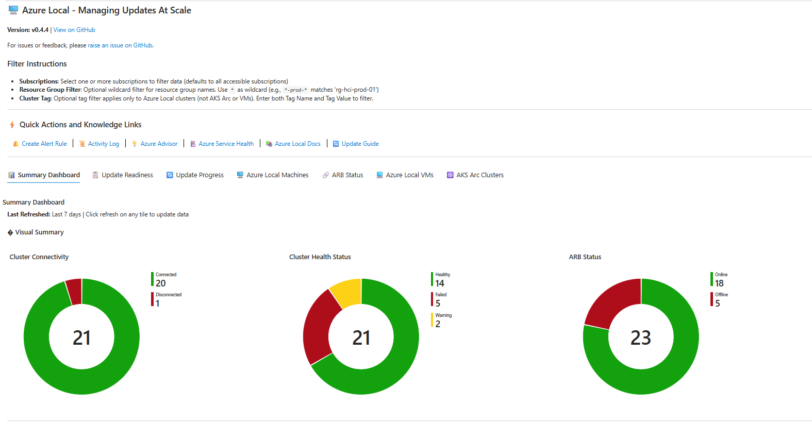
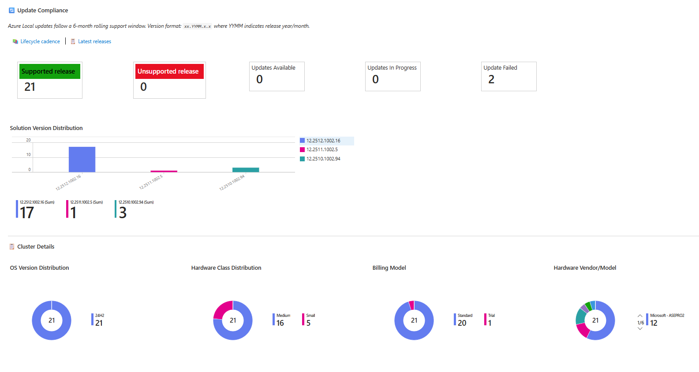
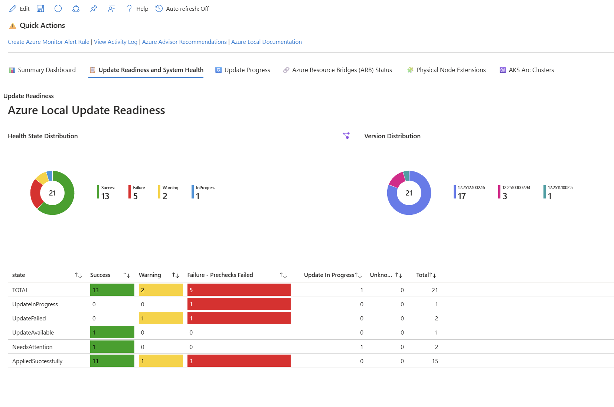
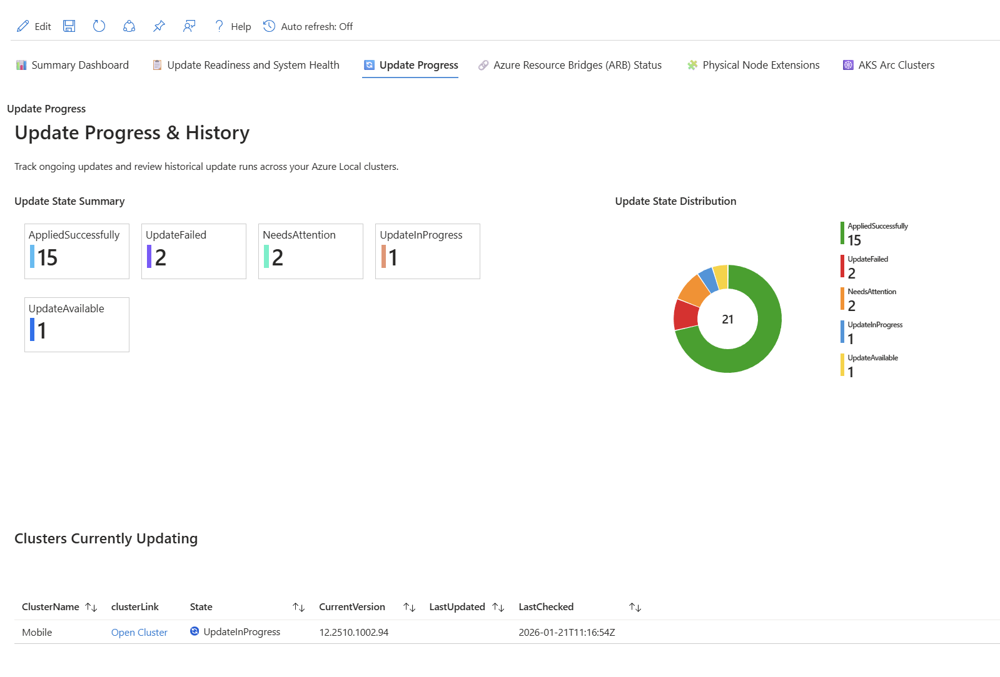
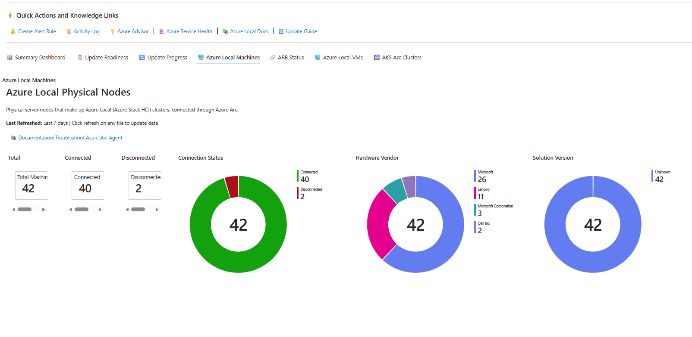
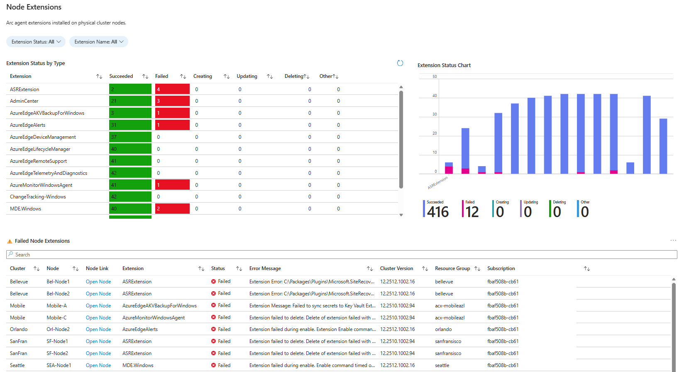
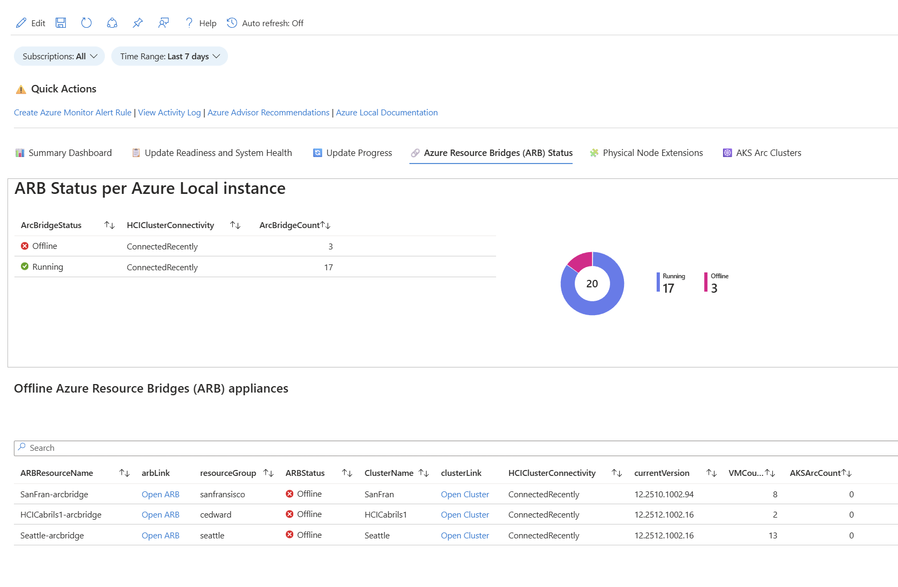
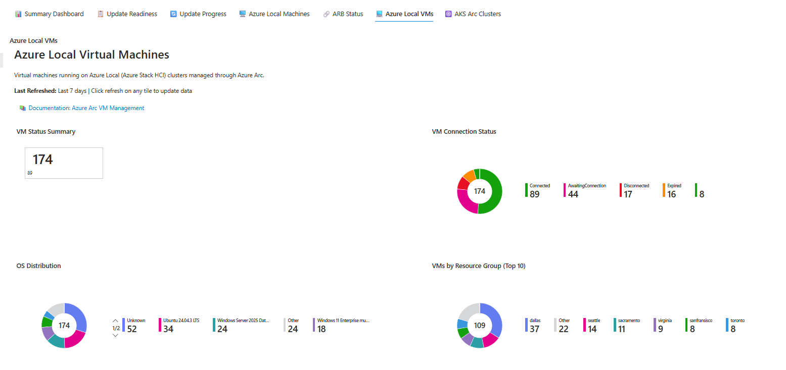
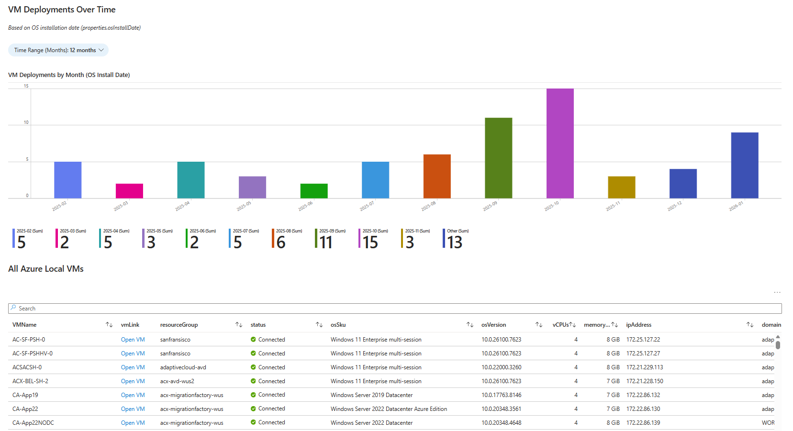
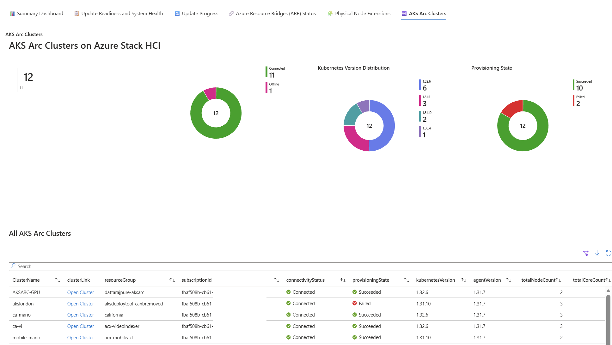

# Azure Local LENS (Lifecycle, Events & Notification Status) Workbook

[](https://github.com/Azure/AzureLocal-LENS-Workbook/actions/workflows/test.yml)
[](https://github.com/Azure/AzureLocal-LENS-Workbook/actions/workflows/codeql.yml)
[](https://github.com/Azure/AzureLocal-LENS-Workbook/actions/workflows/release.yml)
[](https://github.com/Azure/AzureLocal-LENS-Workbook/releases/latest)

## Latest Version: v1.0.2

📥 **[Copy / Paste (or download) the latest Workbook JSON](https://raw.githubusercontent.com/Azure/AzureLocal-LENS-Workbook/refs/heads/main/AzureLocal-LENS-Workbook.json)**

Azure Local Lifecycle, Events & Notification Status (LENS) workbook brings together the signals you need to understand your Azure Local estate through a fleet lens. Instead of jumping between individual resources, you can use a consistent set of views to compare instances, spot outliers, and drill into the focus areas that need attention. LENS workbook provides comprehensive visibility into cluster health, update readiness, and workload status across your entire Azure Local fleet.

**Important:** This is a community-driven / open-source project, (not officially supported by Microsoft), for any issues, requests or feedback, please [raise an Issue](https://aka.ms/AzureLocalLENS/issues) (note: no time scales or guarantees can be provided for responses to issues.)

---

## Table of Contents

- [Overview](#overview)
- [Prerequisites](#prerequisites)
- [How to Import the Workbook](#how-to-import-the-workbook)
- [Features (per-tab walkthrough)](#features)
- [Parameters](#parameters)
- [Quick Actions and Knowledge Links](#quick-actions-and-knowledge-links)
- [Usage Tips](#usage-tips)
- [Azure Resource Graph — Resource Joins Reference](#azure-resource-graph--azure-local-resource-joins--useful-information)
- [What's New (v1.0.2)](#whats-new-v102)
- [What's New (v1.0.1)](#whats-new-v101)
- [v1.1.0 — Planned (post-gallery merge)](#v110--planned-post-gallery-merge)
- [Contributing](#contributing)
- [CI/CD Validation](#cicd-validation)
- [License](#license)
- [Appendix: Previous Versions Change Log](#appendix-previous-versions-change-log)

---

## Overview

This workbook uses Azure Resource Graph queries to aggregate and display real-time information about your Azure Local infrastructure. It's designed to help administrators and operations teams quickly identify issues, track update progress, and maintain overall cluster health across multiple clusters and subscriptions.

The workbook is organized into eight tabs:

📊 Azure Local Instances | 🏗️ Capacity | 📋 System Health | 🔄 Update Progress | 🔗 ARB Status | 🗄️ Azure Local Machines | 💻 Azure Local VMs | ☸️ AKS Arc Clusters

## Prerequisites

- Access to Azure subscriptions containing Azure Local clusters
- **Reader permissions** on the resources you want to monitor
  - The workbook automatically queries across **all subscriptions you have access to** within your Microsoft Entra tenant
  - You will only see data for resources where you have at least Reader access
  - **Azure Lighthouse**: If you have Azure Lighthouse delegations configured, Azure Resource Graph will also query across delegated subscriptions in customer tenants, allowing cross-tenant visibility from your managing tenant
  - **Note**: Data is scoped to your Microsoft Entra tenant (plus any Lighthouse-delegated subscriptions) — you cannot query resources in other tenants without Lighthouse delegation
- Access to Azure Monitor Workbooks in the Azure portal

## How to Import the Workbook

1. **Navigate to Azure Monitor Workbooks**
   - Open the [Azure portal](https://portal.azure.com)
   - Search for "Monitor" in the search bar and select **Monitor**
   - In the left navigation, select **Workbooks**

2. **Create a New Workbook**
   - Click **+ New** to create a new workbook
   - In the empty workbook, click the **Advanced Editor** button (</> icon) in the toolbar

3. **Import the JSON Template**
   - In the Advanced Editor, select the **Gallery Template** tab
   - Delete any existing content in the editor
   - Copy the entire contents of the [`AzureLocal-LENS-Workbook.json`](https://raw.githubusercontent.com/Azure/AzureLocal-LENS-Workbook/refs/heads/main/AzureLocal-LENS-Workbook.json) file
   - Paste the JSON content into the editor
   - Click **Apply**

4. **Save the Workbook**
   - Click **Done Editing** to exit edit mode
   - Click **Save** or **Save As** in the toolbar
   - Provide a name (e.g., "Azure Local LENS Workbook")
   - Select a subscription, resource group, and location to save the workbook
   - Optional — set the "Auto refresh: xx minutes" to once every 30 minutes or 1 hour
   - Click **Save**

5. **Pin to Dashboard (Optional)**
   - After saving, you can pin individual tiles or the entire workbook to an Azure dashboard for quick access

## Features

### 📊 Azure Local Instances
A high-level overview of your entire Azure Local estate, including:
- **Visual Summary Charts**: Pie charts showing cluster connectivity, health status, and Azure Resource Bridge (ARB) status
- **Azure Local Totals and Connectivity**: Tile metrics for total clusters, connected/disconnected clusters, connection percentage, total machines, and offline ARBs
- **Health and Patching Status**: Healthy clusters, health warnings, failed prechecks, failed extensions, and health percentage
- **Update Compliance**: 
  - Tiles showing clusters on supported release (green), unsupported release (red), updates available, updates in progress, and update failures
  - Version compliance calculated based on the YYMM component of the cluster version (e.g., `xx.2512.x.x` = December 2025 release) with 6-month rolling support window
  - Links to Lifecycle cadence and Latest releases documentation
  - Solution Version Distribution bar chart showing cluster counts by version
- **Workload Summary**: Total Azure Local VMs and AKS Arc clusters
- **Cluster Details Charts**: 
  - OS version distribution (e.g., 24H2, 23H2)
  - Hardware class distribution (Small, Medium, Large)
  - Billing model breakdown
  - Hardware vendor/model distribution
- **All Clusters Table**: Comprehensive list with solution version, node count, total cores, total memory, OS version, hardware class, manufacturer, model, last sync, registration date, Azure Hybrid Benefit, Windows Server Subscription, and Azure Verification for VMs
- **Licensing & Verification Charts**: Pie charts showing Enabled/Disabled distribution across clusters for Azure Hybrid Benefit, Windows Server Subscription, and Azure Verification for VMs
- **Clusters Not Synced Recently**: Table showing clusters that haven't synced in 24+ hours with color-coded severity





### 🏗️ Capacity
Centralized view of cluster resource utilization, capacity forecasting, and workload allocation. The tab is split into four sub-tabs (selectable via the **CapacitySection** picker): **📋 Overview**, **🔍 Single cluster**, **🌍 Multi-cluster**, and **🖥️ Hyper-V VMs**.

#### 📋 Overview sub-tab
- **Cluster Capacity Overview** table — one row per cluster:
  - Physical Cores and Physical Memory (GB)
  - VM vCPUs and AKS vCPUs (from provisioned workloads)
  - vCPU Total (combined VM + AKS) and VM Memory Total (GB)
  - V:P CPU Ratio (e.g., `4.2:1`) — computed inline via Azure Resource Graph sub-joins
  - **Target vCPU:pCPU Ratio** drop-down (default `4:1`) lets you flag clusters whose actual ratio exceeds your target
- **Capacity DCR Setup Guide** (collapsible) — everything required to make the Top 5 Log-Analytics charts work:
  - Prerequisites (Azure Monitor Agent, Log Analytics workspace, RBAC, regions)
  - Required Performance Counters table (Processor / Memory / LogicalDisk / Cluster CSV File System / Network Interface)
  - Recommended **Custom counter specifier** workflow for portal users (covers `Cluster CSV File System` counters that are missing from the portal dropdown)
  - Sample ARM template (`dcr-azurelocal-capacity.json`) and `az deployment group create` deployment steps
- **Top 5 Azure Local Instances by Resource Capacity Usage** — Top-5 line/area charts (size: large) sourced from Log Analytics:
  - CPU Usage (%) · Memory Usage (%) · Storage Usage (%) · Storage Latency (ms) · Storage IOPS · Network Throughput (MB/s)
- **AKS Node usage** — Prometheus-sourced timecharts of Top AKS Nodes by CPU, Memory, Disk I/O (bytes/sec), and Network Throughput (bytes/sec)

#### 🔍 Single cluster sub-tab
Drill into a single cluster (selected via the `SingleCluster` picker):
- **🏗️ Cluster Capacity** tiles — Clusters, Nodes, Node Hardware Summary
- **Capacity & Performance of Physical Machines** — per-node timecharts: CPU Usage (%), Memory Usage (%), Storage Usage (%), Storage Latency (ms), Storage IOPS, Network Throughput (MB/s) — all "By Machine"
- **💾 Storage Volume Usage and Forecast** — Storage Volume Usage (GB) and Volume Usage (%) charts per cluster volume
- **📊 Storage Pool Trends & Forecast** — Storage Pool Remaining (%) and Storage Pool Remaining (TB) Actual-vs-Forecast charts
- **⚙️ Compute Trends & Forecast** — CPU Usage (%) and Memory Usage (%) Actual-vs-Forecast for the selected cluster
- **📦 Workloads on Cluster** section:
  - 🖥️ Azure Local VMs running on the cluster
  - 🪟 **Hyper-V VMs on the cluster** — Perf-derived view scoped to the selected cluster's physical hosts (reuses the same **Log Analytics Workspace** and **Historic Time Range** pickers as the per-machine charts above). Includes the inventory table plus six Top-5 trend charts: VM CPU (`% Guest Run Time`), VM Memory Pressure (Dynamic Memory `Current Pressure`), VHD Storage Throughput (MB/s), VHD Storage IOPS, VHD Storage Latency (ms), and VM Network Throughput (MB/s) — same counters and queries as the **🪟 Hyper-V VMs** sub-tab, but filtered to this cluster only
  - ☸️ AKS Arc Clusters running on the cluster (for per-node AKS performance, see the **AKS Node Performance (Azure Managed Prometheus)** section at the bottom of the **Overview** sub-tab — Prometheus metrics carry no Azure Local cluster label, so a single AKS performance view applies fleet-wide)

#### 🌍 Multi-cluster sub-tab
Fleet-wide capacity trending and forecasting:
- **Predictive Resource Exhaustion Forecast by Cluster** — projected days until each cluster crosses warning / critical utilisation thresholds (computed with `series_fit_line` linear trend analysis); shows current average %, trend direction, and 🟢/🟡/🔴 status
- **Cluster-wise CPU Forecast** and **Cluster-wise Memory Forecast** — Actual-vs-forecast lines per cluster
- **Storage Remaining (%) — Cluster Forecast** and **Storage Available (TB) — Cluster Forecast**
- **💾 Storage & Network Performance — For Selected Clusters**:
  - Storage Latency (ms) · Storage IOPS · Network Throughput (MB/s) timecharts for the selected cluster set
- Forecast disclaimer banners are shown alongside each forecast chart

#### 🖥️ Hyper-V VMs sub-tab
Hyper-V VM performance, sourced entirely from Log Analytics (covers all hypervisor-visible VMs, including VMs not onboarded to Arc):
- **Hyper-V DCR Setup Guide** (collapsible) — prerequisites, required Hyper-V counters table (`Hyper-V Hypervisor Virtual Processor`, `Hyper-V Dynamic Memory VM`, `Hyper-V Virtual Storage Device`, `Hyper-V Virtual Network Adapter`), Custom counter specifier walkthrough, sample ARM template (`dcr-azurelocal-hyperv.json`), deployment steps, and a Kusto helper to verify counters are flowing
- **📊 Active VMs (from Log Analytics)** summary
- **📋 Hyper-V VM Inventory (Perf-derived)** — filterable by VM Name (contains), Physical Host (multi-select), and Activity (All / Currently active in last 15 min / Active in last hour / Stale)
- **Top VMs / Top Virtual Disks** charts:
  - 📈 Top VMs by CPU Usage — % Guest Run Time (0-100% per vCPU)
  - 📈 Top VMs by Memory Pressure (≤80 healthy · 100 = at limit · >100 under pressure)
  - 📈 Top Virtual Disks by Storage Throughput — Read+Write MB/s (per VHD/VHDX)
  - 📈 Top Virtual Disks by Storage IOPS — Read+Write Operations/sec (per VHD/VHDX)
  - 📈 Top Virtual Disks by Storage Latency — ms (<10 healthy · 10-20 watch · >20 stressed)
  - 📈 Top VMs by Network Throughput — Send+Receive MB/s (guest vNICs only)

### 📋 System Health
Detailed view of cluster system health and update readiness:
- **Health State Distribution** chart and **Update Readiness Summary** matrix (Update Status × Overall Health State)
- **System Health Check Filters** — narrow checks by Cluster, Overall Health State, and Check Severity (defaults exclude Informational)
- **System Health Checks Overview** table — one row per failure reason, sorted by cluster count (highest first), with friendly health-state vocabulary (Healthy / Critical / Warning / In progress / Health check failed / Unknown)
- **🔍 24 Hour System Health Checks - Detailed Results** — per-check breakdown for the most recent 24 hours, including `Health Check - Name / Description / Remediation` columns
- Tip banner with link to Microsoft documentation for troubleshooting Azure Local updates



### 🔄 Update Progress
Track ongoing and historical updates across your clusters:
- **Update State Summary** tiles and **Update State Distribution** pie chart
- **Update Attempts by Day** stacked bar chart (Succeeded / Failed / InProgress per day)
- **Update Duration Statistics by Solution Update** — min/avg/max duration per solution version
- **Updates - First Time Success Analysis** — first-time success rate per cluster/solution version
- **Update Outcomes Distribution** and **Update Attempts by Status Percentages** charts
- **Update Attempts Details** table with cluster, update name, state, status, and link to the run
- **⏳ Clusters Currently Updating** — live status with current step description
- **📦 Clusters with Updates Available** table with:
  - Direct link to apply One Time Update in Azure Update Manager
  - Link to Azure Local Known Issues documentation
  - SBE (Solution Builder Extension) dependency details
- **🔄 All Cluster Update Status** table with information about the 6-month support window
- **📜 Update Run History and Error Details** table:
  - Default filter: `Update State = Failed` (unresolved failures are surfaced regardless of Time Range; once a later Succeeded run exists for the same cluster, the older Failed run is hidden)
  - Direct link to view the update run in Azure portal
  - Current step description and extracted error details for failed updates
  - Human-readable duration (e.g., `1h 7m 15s`)



### 🗄️ Azure Local Machines
Comprehensive view of physical server machines in Azure Local clusters:
- **Last Refreshed timestamp** and documentation links
- **Machine Overview**:
  - Connection status summary tiles (Total, Connected, Disconnected)
  - Connection status pie chart
  - Hardware vendor distribution pie chart
  - OS version distribution pie chart
  - Arc Agent version distribution pie chart
  - License type distribution pie chart
- **All Machines Table** (sorted with Connected first) with details including:
  - Machine name and cluster association
  - Connection status with icons
  - vCPUs (logical core count) and memory (GB)
  - Hardware vendor, model, and processor
  - Solution version, IP address, and OS version
  - Last status change
- **Disconnected Machines** warning table showing:
  - Disconnected nodes with OS version information
  - Time since disconnection
  - Associated cluster and resource group details
- **Machine Extensions**:
  - Filter by extension status (Succeeded, Failed, Creating, Updating, Deleting)
  - Filter by extension name
  - Extension status summary table and bar chart
  - Failed extensions table with error details
- **Network Adapter Details**:
  - Filter by Machine Name and NIC Status (Up/Down)
  - **Note**: Cluster Tag filtering is not supported for this section due to Azure Resource Graph query limitations
  - NIC Status Distribution pie chart showing Up/Down/Disconnected counts (respects filters)
  - NIC information from edge devices including adapter name, type, status, and interface description
  - Machine Name column showing actual host names (joined from hybrid compute machines)
  - Cluster column with link to the Azure Local cluster resource in Azure portal
  - NIC Type (Virtual or Physical) derived from interface description
  - Status with icons (Up = green, Down = red)
  - Driver version for each network adapter
  - IP address, subnet mask, default gateway, and DNS servers
  - MAC address for hardware identification





### 🔗 ARB Status
Monitor the status of Azure Resource Bridge appliances:
- Warning banner about 45-day offline limit (displayed below Offline ARBs section) with link to troubleshooting documentation
- ARB status summary per Azure Local instance with pie chart
  - Shows all ARBs including orphaned ones (where cluster has been deleted)
  - "Unknown" displayed for HCIClusterConnectivity when cluster is missing
  - Sorted with Running status first
- Offline ARB appliances table showing ALL offline ARBs regardless of cluster connection status
- **Last Modified** timestamp and **Days Since Last Modified** with color coding:
  - Green: 0 days
  - Yellow: 1-14 days
  - Red: More than 14 days
- All ARB appliances table with filters for ARB Status and Cluster Name
- Shows "Connected" (green) for Running ARBs or days since last modified (yellow) for Offline ARBs
- Direct links to open ARB and cluster resources in the Azure portal
- **ARB Alert Rules Configuration** (toggle to show/hide):
  - Table with direct links to create Resource Health and Activity Log alerts for each ARB
  - Recommended alert types with severity guidance
  - Step-by-step instructions for manual alert creation
  - Quick links to Action Groups, Alert Rules, and documentation



### 💻 Azure Local VMs
Monitor virtual machines running on Azure Local clusters:
- VM status summary tiles showing total VMs and connection status
- VM connection status distribution pie chart
- OS distribution pie chart showing operating system breakdown
- VMs by resource group distribution
- Bar chart showing VM deployments over time based on OS install date (configurable 1-24 months)
- Complete list of all VMs with details including:
  - OS SKU and version
  - vCPUs and memory (GB)
  - IP address
  - Domain name
  - Agent version
  - OS install date and last status change
- VMs grouped by hosting Azure Local cluster with hardware specs
- VM distribution bar chart by cluster





### ☸️ AKS Arc Clusters
Monitor AKS Arc clusters running on Azure Local:
- Summary tiles showing total clusters, connected/offline, and provisioning state
- Connectivity status distribution pie chart
- Kubernetes version distribution pie chart
- Provisioning state pie chart
- Bar chart showing cluster deployments over time (configurable 3-24 months)
- Complete list of all AKS Arc clusters with details including:
  - Node count and total core count
  - Kubernetes and agent versions
  - Distribution type
  - Last connectivity time
  - Certificate expiration date
  - Cluster creation date
- Certificate expiration warning table showing clusters with certificates expiring within 30 days
- **AKS Arc Cluster Extensions**:
  - Filter by extension status (Succeeded, Failed, Creating, Updating, Deleting)
  - Filter by extension name
  - Extension status summary table and bar chart (similar to Node Extensions)
  - Failed extensions table with error details
- **Flux Configurations**:
  - **📋 All Flux Configurations** — full inventory across AKS Arc clusters
  - **⚠️ Non-Compliant Flux Configurations** — filtered view of configurations not in a compliant state



## Quick Actions and Knowledge Links

The workbook includes convenient quick action links to:
- 💬 Azure Local Supportability Forum
- 📚 Azure Local Documentation
- 🧩 Solution Builder Extension (SBE) Updates
- 🔄 Azure Local Update Guide
- 📜 View Activity Log
- 🏥 Azure Service Health Status
- 🔔 Create Azure Monitor Alert Rules

## Parameters

The workbook provides several filtering options to help you focus on specific resources:

### Scope Filters
- **Subscriptions**: Filter data by one or more Azure subscriptions (defaults to all accessible subscriptions)

### Resource Group Filter
- **Resource Group Filter**: Optional wildcard filter for resource group names
  - Use `*` as a wildcard character to match any sequence of characters
  - Examples:
    - `*-prod-*` matches resource groups containing "-prod-" (e.g., "rg-hci-prod-01", "azure-prod-cluster")
    - `*hci*` matches any resource group containing "hci"
    - `rg-*` matches resource groups starting with "rg-"
  - Leave empty to show all resource groups

### Cluster Tag Filter
- **Cluster Tag Name**: The name of the tag to filter by (e.g., "Environment", "Team", "CostCenter")
- **Cluster Tag Value**: The value of the tag to match (e.g., "Production", "IT-Ops")
- **Note**: Tag filtering is applied to Azure Local clusters. AKS Arc clusters and Azure Local VMs in the same resource group as matching clusters are also filtered via resource group association
- Both Tag Name and Tag Value must be provided for the filter to take effect

### Time Range
- **Time Range**: Select the time range for time-based queries (1 day to 60 days, or custom; defaults to 45 days)

## Usage Tips

- Use the subscription filter to focus on specific environments (e.g., production vs. development)
- Regularly check the System Health tab before scheduling maintenance windows
- Monitor the ARB Status tab to ensure Azure Arc connectivity is healthy
- Export data to Excel using the export button on grids for reporting purposes
- Set up Azure Monitor alerts based on the queries in this workbook for proactive monitoring

## Azure Resource Graph | Azure Local Resource Joins | Useful Information

Understanding how Azure Local resources are linked across Azure Resource Graph (ARG) is essential for building accurate queries. The workbook uses the following join chains to associate workload resources with their parent HCI cluster:

- **Azure Local VMs:** `machine.id` → `microsoft.azurestackhci/virtualmachineinstances` (extensibility, joined by extracting machineId before `/providers/Microsoft.AzureStackHCI`) → `extendedLocation.name` → custom location → `arcBridgeRG` → HCI cluster

- **AKS Arc Clusters:** `connectedcluster.id` → `microsoft.hybridcontainerservice/provisionedclusterinstances` (extensibility, joined by extracting aksId before `/providers/Microsoft.HybridContainerService`) → `extendedLocation.name` → custom location → `arcBridgeRG` → HCI cluster

- **Storage Volumes:** `microsoft.azurestackhci/storagecontainers` (joined by `extendedLocation.name`) → custom location (joined by extracting `arcBridgeRG` from `hostResourceId`) → HCI cluster (joined by `resourceGroup`)

> **Key concept:** The Arc Resource Bridge appliance and the HCI cluster are always deployed in the same resource group (`arcBridgeRG`). Custom locations reference the Arc Bridge via `properties.hostResourceId`, and the bridge's resource group is extracted with `split(hostResourceId, '/')[4]`. This resource group is then used to join to the HCI cluster.

## What's New (v1.0.2)

A small post-v1.0.1 patch driven by customer end-to-end testing of the Capacity → Overview DCR Setup ARM template.

1. **Capacity → Overview → Show DCR Setup Guide → Alternative — ARM / CLI Deployment: ARM template expanded from 13 to 27 performance counters** so a single deployment now produces a **complete LENS Capacity DCR** — enough telemetry for every Capacity sub-tab to populate, including **🖥️ Hyper-V VMs** and the **🪟 Hyper-V VMs on: {cluster}** section on the **🔍 Single cluster** sub-tab. The 14 added counter paths are: `\Hyper-V Hypervisor Virtual Processor(*)\% Guest Run Time`, `\% Hypervisor Run Time`, `\% Total Run Time`; `\Hyper-V Dynamic Memory VM(*)\Current Pressure`, `\Physical Memory`, `\Guest Visible Physical Memory`; `\Hyper-V Virtual Storage Device(*)\Read Bytes/sec`, `\Write Bytes/sec`, `\Read Operations/Sec`, `\Write Operations/Sec`, `\Latency`; `\Hyper-V Virtual Network Adapter(*)\Bytes/sec`, `\Bytes Sent/sec`, `\Bytes Received/sec`. The `windowsEventLogs` block carrying the SDDC `Microsoft-Windows-SDDC-Management/Operational!*[System[(EventID=3002)]]` XPath (required by the Storage capacity / volume forecast tiles) was already included in v1.0.1 and is unchanged. Net effect: customers can now deploy the embedded ARM template once, associate the resulting DCR to every Azure Local node, and have **every** Capacity tab — cluster-aggregate **and** per-VM Hyper-V — light up without a second DCR. The companion **Required Performance Counters** table breadcrumb note (Fix 19 in v1.0.1) and the **Steps** walkthrough underneath the table were both updated to call out that the ARM template path is now a one-shot for full coverage, while the **Custom counter specifier** portal flow above still only requires the 5 `Cluster CSV File System(*)` paths (host counters are in the portal's preset dropdown, and the Hyper-V counters can be added via the same Custom flow or via the dedicated Hyper-V sub-tab's own DCR Setup Guide).

2. **New [`example-dcr-template/`](example-dcr-template/) folder** — the same 27-counter template is now also checked into the repo as a **standalone, deploy-from-file ARM template** at [`example-dcr-template/dcr-azurelocal-capacity-perf.json`](example-dcr-template/dcr-azurelocal-capacity-perf.json), with a companion [`example-dcr-template/README.md`](example-dcr-template/README.md) containing step-by-step `az deployment group create` + DCRA-association instructions, a verification KQL snippet, troubleshooting tips, **and an explicit explanation that a single Arc-enabled machine can have multiple DCR associations** (the Azure Monitor Agent collects the **union** of counters from every associated DCR, so this template is **additive** to any DCRs you already have — Defender for Cloud, custom application telemetry, `Microsoft-Process`, etc.). Customers who prefer source-controlled IaC over copy-pasting JSON out of the workbook UI can now `curl -L -o dcr-azurelocal-capacity-perf.json …` straight from `main`. The workbook's embedded **🛠️ Alternative — ARM / CLI Deployment** section now cross-links to the repo file.

3. **Log Analytics workspace cost & retention callout** added to both the in-workbook *Deployment Steps* tile and the new folder README, reminding customers to review their **workspace data-retention period (default 30 d, up to 730 d), per-table retention overrides on `Perf` / `Event`, long-term archive retention, commitment tiers / capacity reservations, and the daily ingestion cap** before associating this DCR to a production fleet — and pointing at Microsoft's [Cost optimization and Azure Monitor — best practices](https://learn.microsoft.com/azure/azure-monitor/fundamentals/best-practices-cost) guide as the canonical reference (which also covers DCR-side filtering / transformations for dropping unwanted rows before they hit the workspace). LENS only reads from the workspace, so cost is driven by ingestion / retention on the workspace itself, not by the DCR.

4. **Cluster Insights DCR-overlap & duplicate-ingestion warning** added to both the workbook's *Why does LENS need DCR work* FAQ and the standalone folder README. The Arc Cluster Insights auto-managed DCR collects a broader Windows event set (`Microsoft-Windows-SDDC-Management/Operational` for EventIDs **3000 / 3001 / 3002 / 3003 / 3004** plus `microsoft-windows-health/operational!*`), but the LENS workbook today only consumes `EventID=3002` — so the example template ships only that one XPath by default to avoid duplicate ingestion when both DCRs point at the same workspace. The new guidance documents the Azure Monitor Agent's **no-cross-DCR-deduplication** behaviour (each associated DCR is evaluated independently → overlapping rows are ingested *once per DCR*, doubling cost on the overlap), with three explicit choices for customers: (a) keep default scope on the same workspace and accept the tiny Event 3002 overlap, (b) point this DCR at a separate workspace, or (c) broaden this template's `windowsEventLogs` block to the full Cluster Insights event set **and** disable Cluster Insights so only one DCR collects the events. The folder README includes a copy-paste `xPathQueries` snippet for option (c).

5. **Fleet-wide DCR-association loop via Azure Resource Graph** added to both the workbook's *Deployment Steps* tile (as variant **3b**) and the standalone folder README (as **Option B**). The original `az connectedmachine list -g <cluster-rg> …` loop is great for a single resource group, but customers managing multiple Azure Local clusters across many RGs in the same subscription now have a one-shot ARG query that returns **every Arc-enabled Azure Local host** in the subscription. The key filter is `properties.cloudMetadata.provider =~ 'AzSHCI' and tostring(properties.detectedProperties.model) !~ 'Virtual Machine'` — the second clause is the **only reliable way to exclude Arc-onboarded guest VMs** that happen to live in cluster resource groups: Hyper-V reports the model as the literal string `Virtual Machine` for Gen 1/2 VMs, whereas physical hosts report their actual hardware model (`ASEPRO2`, `ThinkSystem …`, `PowerEdge …`, etc.). Filtering on `kind` or `properties.parentClusterResourceId` is **not** sufficient — Arc-onboarded guest VMs on an Azure Local cluster inherit `provider = AzSHCI` and have `kind = ""` just like the physical hosts, and some real cluster nodes (Azure Stack Edge Pro, certain Lenovo ThinkSystem SKUs) report `parentClusterResourceId = null`. A small **💡 Sanity check first** callout reminds operators to inspect the resulting host list before associating, and a footnote covers the one-time `az config set extension.use_dynamic_install=yes_without_prompt` setting that suppresses the `monitor-control-service` extension-install prompt across a long loop.

6. **New `Cluster Name` column on the 📋 Hyper-V VM Inventory (Perf-derived) table** on the **🖥️ Hyper-V VMs** sub-tab — placed immediately after `Physical Host`, clickable, and links straight to the cluster's portal blade. Resolution method: join `Perf.Computer` (FQDN suffix stripped, case-insensitive) to the authoritative `ClusterNodeMap` shared parameter, which is itself sourced from each cluster's `microsoft.azurestackhci/clusters → reportedProperties.nodes[].name` array — the same source of truth Azure Local uses internally and the same join pattern v1.0.1 Fix 5 (memory tiles SDDC-Event-3002 decoupling) and v1.0.1 Fix 13 (Single-cluster Node Hardware Summary phantom-node fix) already rely on. A blank `Cluster Name` cell signals an out-of-scope or non-Azure-Local Hyper-V host. The equivalent table on the **🔍 Single cluster** sub-tab is intentionally left unchanged because the cluster is already pinned via the `SingleCluster` filter there.

7. **Naming + region polish across the same workflow** so the resources customers see in their subscription self-identify as belonging to the LENS workbook: the embedded ARM template's `dcrName` default value, the standalone-template-folder README's H1, the curl one-liner target, the deployment-name `-n`, and every cross-link were aligned on **`dcr-azurelocal-lens-capacity-perf`** for the DCR resource and **`azlocal-lens-capacity-dcra`** for the per-machine association name (file path on disk and `--template-file` argument remain `dcr-azurelocal-capacity-perf.json` so the existing repo file location stays valid). A **🌍 Region note** callout was also added to both the workbook *Deployment Steps* tile and the folder README clarifying that the **DCR and the Log Analytics workspace must be in the same region** (a hard Azure Monitor requirement), that the template's `location` parameter defaults to `[resourceGroup().location]` which only happens to be correct when the target RG and the LAW are co-located, and that **DCR associations (DCRAs) are region-agnostic** — they follow the *Arc machine's* region — so the step-3 association loop works regardless of cross-region geometry. Includes a copy-paste `LAW_REGION=$(az monitor log-analytics workspace show … --query location -o tsv)` snippet for the parameter override.

No workbook-functional changes in this patch beyond the embedded ARM template's counter list and the new Cluster Name column. The standalone **🖥️ Hyper-V VMs** sub-tab continues to ship its own dedicated, scoped ARM template for customers who want Hyper-V telemetry **only** (i.e. without the host counters). The workbook header banner bumps from `v1.0.1` to `v1.0.2`.

## What's New (v1.0.1)

This is a targeted quality release driven by direct customer feedback. It contains eighteen independent content fixes plus six cross-cutting UX polish changes:

1. **Capacity Overview column reframe** so the table answers two distinct questions side-by-side instead of one ambiguous question (paraphrased feedback: *"the numbers in the Capacity Overview don't match the per-node memory usage I see in Cluster Insights"*).
2. **Lowercase-id casing fix** to a join chain used by 5 workbook tabs that silently drops Arc-managed VMs and AKS Arc clusters whose `extensibilityresources` ID was registered in lowercase casing — most commonly seen with **Azure Virtual Desktop (AVD) on Azure Local** VMs.
3. **ARB control-plane VM memory deduction** so the Capacity Overview table denominator accounts for the ~8 GiB consumed by the Azure Resource Bridge appliance VM that runs on every Azure Local cluster.
4. **Memory Usage (%) — Top 5 Clusters chart** rewritten to match Cluster Insights (`Committed / (Committed + Available)`) instead of the misleading `% Committed Bytes In Use` counter, which used Commit Limit (physical RAM + page file) as its denominator and consistently under-reported usage.
5. **Memory tiles no longer require the SDDC-Management event log** ([#79](https://github.com/Azure/AzureLocal-LENS-Workbook/issues/79)) — a new `ClusterNodeMap` shared parameter (built from Azure Resource Graph) replaces the `Microsoft-Windows-SDDC-Management/Operational` Event 3002 dependency on every memory tile across Capacity-Overview, Capacity-MultiNode, and Capacity-SingleNode. Reported feedback: validation in a test environment showed one cluster reporting 91 % peak memory in the Microsoft-supplied Single-Cluster AMA Insights workbook but only 35.1 % in the LENS Multi-Node forecast table.
6. **Capacity-Overview “DCR Setup Guide” expanded** with a new **Required Windows Event Log** subsection that documents the Event 3002 requirement (storage volume-size forecasts only) plus the matching `windowsEventLogs` block in the embedded ARM template. The Required Performance Counters table is updated to list `Memory\Committed Bytes` + `Memory\Available Bytes` (Fix 4). The Capacity-Multi-Node header tip cross-references this section.
7. **Single-node clusters now show “No HA resiliency”** instead of an N-1 percentage — because a single-machine cluster cannot tolerate any node loss and workloads always go offline during planned events such as Azure Local monthly updates.
8. **Storage Latency and Storage IOPS charts on Capacity-MultiNode + Capacity-SingleNode now include S2D CSV volumes.** Previously these four charts filtered to `ObjectName == "LogicalDisk"` with `InstanceName == "_Total"`, so they only reflected the **OS / boot disk** — not the Storage Spaces Direct (S2D) CSV volumes where customer workloads actually run. Queries now union the same three perfmon objects already used by the Capacity-Overview Storage Latency / IOPS charts (`LogicalDisk` + `Cluster CSV File System` + `Cluster Shared Volume`), exclude `_Total` and `HarddiskVolume1`, and remain inner-joined to the `NodeToCluster` map built from `Microsoft-Windows-SDDC-Management/Operational` Event 3002 so only physical Azure Local nodes contribute (no guest-VM contamination).
9. **Azure Local VMs tab — RG-based cluster join replaced with the canonical Arc-Bridge extensibility chain** so **AVD session-host VMs** (deployed by the AVD host-pool wizard into a separate session-host resource group) and any other Azure Local VMs deployed into a workload RG that differs from the cluster RG are now correctly counted and displayed in all ten tiles on the **🖥️ Azure Local VMs** tab. The previous join `vmResourceGroup == clusterResourceGroup` only worked when VMs lived in the same RG as their host cluster; it silently dropped every AVD VM out of view (tile counts, status / OS pie charts, by-RG and by-cluster bar charts, deployment-trend chart + table, and the main inventory grid).
10. **Error Details flyouts — `pack()` property-grid rendering** so the side flyouts on the **🔄 Update Progress** *Update Run History* table, the **🖥️ Azure Local VMs** *Failed Node Extensions* table, and the **☸️ AKS Arc Clusters** *Failed AKS Extensions* and *Non-Compliant Flux Configurations* tables now show clean labelled key/value rows (Cluster / Update / Current Step / Error Message / Troubleshooting URL / etc.) instead of a single narrow text box containing raw markdown source. Implementation: the column referenced by the `linkTarget: "CellDetails"` formatter is now a KQL `dynamic` built with `pack(label, value, …)`, which the Workbooks property-grid renderer surfaces natively as one labelled row per pack entry. Field text still wraps and word-breaks naturally, so multi-line stack traces are readable without horizontal scrolling.
11. **Azure Local VMs tab — `VMs Deployed by Month` ARG bug fix** so the deployment-trend bar chart and its accompanying table no longer fail with `Table extensibilityresources was referenced as right table 2 times`. Azure Resource Graph rejects a query that joins to `extensibilityresources` twice on the right side; the two original joins (Arc-Bridge custom-location lookup + VM-instance creation timestamp) are now collapsed into a single right-side `mv-expand` pattern that derives both `parentId` and `createdAt` from one pass over the extensibility resource set.
12. **Azure Local VMs tab — duplicate VM tables merged + Cluster Name filter + Top-5 + Other pie chart.** Two near-identical inventory grids (*All Azure Local VMs* and *VMs by Azure Local Cluster*) are now a single unified table, with the filter pills block (VM Name, **new** Cluster Name multiselect, VM Status, OS SKU) moved up immediately above it; all four filters now scope both the unified table and the cluster-count chart below it. The `VM Count by Cluster` bar chart has been replaced with a **Top 5 Clusters by VM Count** pie chart that aggregates the remaining clusters into a single `Other (N clusters)` slice, so the chart stays scalable at high cluster counts.
13. **Capacity — Single cluster sub-tab — 'phantom node' fix on the Clusters/Nodes stat tiles + Node Hardware Summary table.** Validation in a test environment showed 3 rows in the **Node Hardware Summary** table for a 2-node test cluster (and 3 in the Nodes stat tile above it), where two were the real cluster nodes and the third was an Arc-onboarded guest VM (4 logical cores / 8 GiB) — clearly not a cluster member. **Root cause:** all three tiles joined `microsoft.hybridcompute/machines` (with `cloudMetadata.provider == 'AzSHCI'` and `kind != 'HCI'`) to the cluster on `resourceGroup` alone, so any Arc-onboarded VM in the cluster's RG with `provider == AzSHCI` was silently counted as a node. **Fix:** the three tiles now derive their node-list from the cluster's authoritative `properties.reportedProperties.nodes[]` array (the same authoritative list the `ClusterNodeMap` shared parameter uses) — the Clusters and Nodes tiles count directly from that array, and the Node Hardware Summary table `mv-expand`s it and INNER joins Arc-machines on `tolower(name) == reportedNodeName` so any Arc-machine NOT present in the cluster's reported nodes (e.g. guest VMs in the same RG) is now correctly excluded. Live-verified in the test environment: `az graph` confirms the cluster's `reportedProperties.nodes[]` array contains exactly the two real cluster nodes, so the phantom row drops from the table.
14. **Capacity — Overview sub-tab — 'counter coverage' stat tiles above each Top-5 chart.** Each of the six Top-5 Capacity Usage charts (CPU, Memory, Storage Usage, Storage Latency, Storage IOPS, Network Throughput) now has a single-number stat tile sitting directly above it that shows the **distinct count of Azure Local nodes** sending the chart's required Performance Counter(s) to the currently-selected Log Analytics workspace(s) over the currently-selected `Node Trends Time Range`. Each tile's title names the exact counter being checked (e.g. *"Count of nodes sending the 'Processor(_Total)\\% Processor Time' counter to selected Log Analytics workspace(s)"*). This makes inconsistent DCRs visible at a glance — if customers see five charts reporting 12 nodes and one chart reporting 8, they know that DCR is collecting only 8 of the 12 nodes' counter data and can act on it. Same `Heartbeat` -> `ClusterRGMap` materialization chain as the charts beneath them, so any node that appears in a chart is by definition counted in the tile above it. **Title attribution sweep:** the three storage tile titles previously named only `LogicalDisk(*)` but their queries already unioned `LogicalDisk`, `Cluster CSV File System`, **and** `Cluster Shared Volume`, plus `InsightsMetrics`; the network tile title named only `Network Interface(*)` but its query reads both `Network Adapter` and `Network Interface`. Titles + chart `noDataMessage`s have been broadened to name every counter object the query actually reads — so a customer collecting only `Cluster CSV File System` (a common S2D-only DCR profile) sees a populated chart **and** a non-zero coverage count, instead of a chart that works with a `0 machines` tile next to it.
15. **Fleet-wide 'phantom node' sweep — Overview / SystemHealth / Azure Local Machines tabs.** Fix 13 corrected the single-cluster Clusters / Nodes / Node Hardware Summary tiles by switching from RG-based Arc-machine joins to the cluster's authoritative `properties.reportedProperties.nodes[]` array. The same anti-pattern existed on **8 stat tiles + pie charts and 4 complex tables on the 🗄️ Azure Local Machines tab** (`All Machines`, `Non-Connected Machines`, `Extension Status`, `Failed Extensions`), on the **🏠 Overview tab** machine-count tiles, on the **📋 System Health tab** `nodeCount` tile, and on the **Machines tab NIC drill-in tiles** which key off `edgedevice-id`. **Fix:** every affected tile now derives its node-list from the canonical `microsoft.azurestackhci/clusters` → `mv-expand reportedProperties.nodes[]` chain (or, for the NIC tiles, parses the edgedevice id and joins to the same node array). The `customLocations.hostResourceId` chain is used unchanged for VMs / AKS Arc joins that genuinely need a cross-RG lookup. The result is consistent node-count semantics across the entire workbook — a cluster reports the same number of nodes regardless of which tab the user is looking at.
16. **Capacity — Single cluster sub-tab — per-machine noDataMessage extensions + section-level data-source tips + storage forecast SDDC callouts.** The six per-machine performance charts on the Single-cluster sub-tab (CPU, Memory, Storage Usage, Storage Latency, Storage IOPS, Network Throughput "By Machine") now have `noDataMessage` text that explicitly names the required Performance Counter(s) and points the user at the **Show DCR Setup Guide** section on the Capacity → Overview tab — the same counter set the Top-5 cluster charts use. Two new section-level tips (above *Capacity & Performance of Physical Machines* and *Compute Trends & Forecast*) explain that those charts read from `Perf` while the Storage Pool / Storage Volume capacity-forecast charts read from `Microsoft-Windows-SDDC-Management/Operational` Event 3002 — so a user seeing capacity-forecast charts populated while per-machine perf charts are empty (or vice-versa) understands which data source is missing. The Capacity → Multi-cluster forecast-table `noDataMessage` (storage row) and the latency / IOPS / network forecast `noDataMessage`s have been aligned to the same pattern (named counters + DCR Setup Guide pointer; storage rows explicitly mention SDDC Event 3002 since that's their exclusive data source). **Forecast smoothing robustness:** all nine `series_decompose_forecast` charts on Capacity-MultiNode + Capacity-SingleNode (CPU / Memory / Storage % / Storage TB / Per-volume Used %) now wrap `series_fill_linear(...)` with `series_fill_forward(series_fill_backward(...))`. `series_fill_linear` only interpolates **interior** nulls; it leaves leading/trailing nulls untouched, which causes `series_decompose_forecast` to emit a *"Partial query failure: some series contain null values"* yellow runtime banner above an otherwise-working chart. Most commonly seen on customers who add `Memory\Committed Bytes` / `Memory\Available Bytes` to their DCR mid-window (so the first portion of the lookback is null) — the forward/backward fill closes those edge gaps so the forecast runs cleanly without the partial-success banner.
17. **Capacity — Single cluster sub-tab — duplicate '📊 AKS Arc Node Resource Usage' section removed.** That section queried Azure Managed Prometheus on `node_cpu_seconds_total` / `node_memory_*` but Prometheus carries no Azure Local cluster label — so its own tip already admitted *"these charts show data from all AKS Arc clusters reporting to the selected Azure Monitor Workspace, not just those on the selected Azure Local cluster"*. The Capacity → Overview tab already has a more complete equivalent (`📈 AKS Node Performance (Azure Managed Prometheus)`, with CPU + Memory + Disk I/O + Network charts and a configurable Prometheus time range). The Single-cluster section + its standalone `AzureMonitorWorkspace` picker have been replaced with a one-line breadcrumb pointing users at the authoritative Overview section.
18. **Capacity — Single cluster sub-tab — new '🪟 Hyper-V VMs on: {cluster}' section** added to the **📦 Workloads on Cluster** panel (alongside the existing 🖥️ Azure Local VMs and ☸️ AKS Arc Clusters sections). Mirrors the inventory table plus six Top-5 trend charts from the standalone **🖥️ Hyper-V VMs** sub-tab (VM CPU `% Guest Run Time`, VM Memory Pressure `Current Pressure`, VHD Storage Throughput MB/s, VHD Storage IOPS, VHD Storage Latency ms, VM Network Throughput MB/s) **but scoped to only the physical hosts of the selected Azure Local cluster** via the same `ClusterRGMap ∩ ClusterNodeMap ∩ Heartbeat` materialization pattern already used by the per-machine charts above. No new parameters: reuses the page's existing **Log Analytics Workspace** picker and **Historic Time Range** picker. The Network chart cross-references the Hyper-V Hypervisor Virtual Processor counter to filter host vNICs / physical NICs out of the `Hyper-V Virtual Network Adapter` rows, matching the Hyper-V VMs sub-tab's logic.
19. **Capacity → Overview — DCR Setup Guide — new '❓ Why does LENS need DCR work when Cluster Insights / the Monitoring blade already show storage numbers?' FAQ** added as the first item inside the *Show DCR Setup Guide* expandable group, with a one-line teaser added to the DCR Setup section header (visible without expanding). The FAQ explains in a comparison table that those three views read from **different telemetry pipelines** — Cluster Insights reads `InsightsMetrics` populated by the Arc VM Insights *auto-managed* DCR; the cluster's Monitoring → Metrics blade reads Azure Monitor *platform metrics* directly from the Azure Local resource provider (bypassing Log Analytics entirely); LENS reads the customer's own workspace, so it can only show what the customer's DCR is collecting. It calls out the root cause of the gap (the portal DCR wizard's preset dropdown does not list `Cluster CSV File System` / `Cluster Shared Volume`, so most customers end up with `LogicalDisk` only — which silently looks fine in the Microsoft-managed pipelines but leaves LENS Storage % / Latency / IOPS / forecast charts empty). Closes a frequently-asked customer-feedback item. Also added a breadcrumb note at the bottom of the Overview's **Required Performance Counters** table pointing per-VM-telemetry seekers to the **🖥️ Hyper-V VMs** sub-tab's own DCR Setup Guide for the additional `Hyper-V Hypervisor Virtual Processor` / `Hyper-V Dynamic Memory VM` / `Hyper-V Virtual Storage Device` / `Hyper-V Virtual Network Adapter` counter set required by the Hyper-V sub-tab and the **🪟 Hyper-V VMs on: {cluster}** section on the Single cluster sub-tab.

**UX polish (cross-cutting):**

- **“Open in query mode” (`</>`) toolbar button** is now enabled on every visible KQL chart and ARG table tile so users can inspect, copy, or edit the underlying query in Logs / Resource Graph Explorer (134 tiles enabled, 22 already had it). Intentionally suppressed on single-number stat-tile (`visualization: "tiles"`) visualizations — 33 tiles cleaned — to avoid clutter.
- **Excel / CSV download** is now enabled on every visible grid / table tile via the toolbar **Export** menu (14 tiles enabled, 32 already had it). Chart visualizations (line / bar / pie / area / scatter) correctly do not show the export menu.
- **DCR Setup Guide — nested “Show Alternative ARM / CLI Deployment” toggle.** The collapsible **🔔 Performance Counter DCR Configuration** section on the Capacity — Overview tab now keeps the **✅ Recommended — Portal Custom-counter-specifier** walkthrough visible by default and gates the **🛠️ Alternative — ARM / CLI Deployment** content (IMPORTANT-warning banner, sample ARM template, `az deployment group create` + DCRA association loop) behind a new `ShowDCRArmAlt` pills parameter (default `no`). Users who want the ARM / CLI path explicitly toggle it on; the default view stays focused on the safest method.
- **Capacity Overview — Storage Used % column polish.** The `Storage Used %` column has been moved into the table's storage cluster (third-to-last, between `AKS vCPUs` and `Storage Used`) so the three storage columns now sit together; and the `Unknown` sentinel rendered when a cluster has no storage telemetry (`storageUsedPct == 0`) now shows the standard yellow warning triangle icon instead of a blank icon, so unknown values are visually distinct from the green / amber / red thresholds.
- **Capacity tab — sub-tabs reordered + `Top AKS Nodes` rename.** The four Capacity sub-tabs now flow in the natural narrative order **📋 Overview → 🔍 Single cluster → 🌍 Multi-cluster → 🪟 Hyper-V VMs** (was Overview → Multi-cluster → Single cluster → Hyper-V) so that users land on the broadest view first, drill into a single cluster, then zoom out to fleet-wide forecasts. The four AKS Prometheus charts on Capacity → Overview also lost their hard-coded "Top 10" prefix (queries already used `topk(5, …)`); titles are now `📈 Top AKS Nodes by CPU Usage`, `📈 Top AKS Nodes by Memory Usage`, `📈 Top AKS Nodes by Disk I/O (bytes/sec)`, `📈 Top AKS Nodes by Network Throughput (bytes/sec)`. README navigation summary updated to match.
- **Capacity Overview — coverage-tile query perf optimization (~2× faster).** The six counter-coverage stat tiles (Fix 14) previously executed `arg_max(TimeGenerated, *)` on the full `Perf` row before counting distinct nodes, which materialized every column and every duplicate row just to compute a `dcount(Computer)`. Each tile now pre-dedupes (`summarize by Computer, ObjectName, CounterName, InstanceName`) before joining to the `ClusterRGMap` lookup, removing the `arg_max` materialize entirely. Measured ~2× wall-clock speedup on a 60-node real-data workspace at 30-day range; tile values are unchanged.

### Lowercase-id casing fix — AVD VMs (and any other VMI with lowercase `id`) now counted correctly

Reported feedback: a customer cluster hosting 3 AVD VMs (6 vCPU / 10 GiB each) plus 2 standard Azure Local VMs (~2 vCPU / ~6 GiB each) showed only `4 vCPUs` and `12.0 GiB` in the Capacity → Overview table — the AVD VMs were silently missing. Root cause: the KQL chain that joins `microsoft.hybridcompute/machines` to its `extensibilityresources` companion (`microsoft.azurestackhci/virtualmachineinstances` for VMs, `microsoft.hybridcontainerservice/provisionedclusterinstances` for AKS Arc) extracts the parent Arc-machine ID using a case-sensitive `indexof()` call against the string literal `/providers/Microsoft.AzureStackHCI`. Azure Resource Graph preserves whatever casing the resource provider used at registration: standard Azure Local VM blade templates emit mixed-case `Microsoft.AzureStackHCI`, but the AVD-on-Azure-Local provisioning path emits lowercase `microsoft.azurestackhci`. KQL's `indexof()` returns `-1` on the lowercase id, then `substring(id, 0, -1)` returns the empty string, and the silently-empty `parentId` causes the leftouter join to drop those rows entirely. The same anti-pattern existed for the AKS provider segment (`Microsoft.HybridContainerService`) and the load-balancer segment (`Microsoft.KubernetesRuntime`).

**Fix:** lowercase both sides — `indexof(tolower(id), "/providers/microsoft.azurestackhci")` etc. The outer `tolower(...)` wrapper that canonicalized the substring result is unchanged, so semantics are preserved for already-working clusters; only the previously-dropped rows recover. **21 occurrences swept across 5 workbook source files** (Capacity-Overview, Capacity-SingleNode, ARB Status, Overview/Instances, AKS Arc Clusters). The **Azure Local VMs** tab is not affected by this *specific* `indexof()`-casing bug because in v1.0.0 its tiles queried `microsoft.hybridcompute/machines | where kind == "HCI"` directly and joined to `microsoft.azurestackhci/clusters` via shared resource group (`vmResourceGroup == clusterResourceGroup`), so they never executed the buggy `indexof(id, "/providers/Microsoft.AzureStackHCI")` substring extraction at all — but that RG-based shortcut introduced a *different* AVD blind spot which is addressed separately by Fix 9 below. Verified by 225/225 tests passing post-sweep with no other content drift.

### Azure Local VMs tab — RG-based cluster join replaced with canonical extensibility chain (AVD session-host VMs now visible)

Reported feedback (follow-on to Fix 2 above): after Fix 2 corrected the lowercase-id bug on the Capacity → Overview rollup so AVD VM vCPUs / memory are counted, a natural next question is whether the **🖥️ Azure Local VMs** tab itself — which lists every individual Azure Local VM, by name, status, OS, IP, cluster, deployment date, etc. — picks up those same AVD VMs. In v1.0.0 it does not. All ten tile queries on that tab (the two top stat tiles, the connection-status and OS pie charts, the "VMs by Resource Group (Top 10)" bar, the deployment-trend bar + table, the main "All Azure Local VMs" inventory grid, the "All Azure Local VMs by Cluster" inventory grid, and the "VM Distribution by Cluster" bar chart) join `microsoft.hybridcompute/machines | where kind == "HCI"` to `microsoft.azurestackhci/clusters` on `vmResourceGroup == clusterResourceGroup`. That shortcut works for VMs deployed by the standard Azure Local VM blade (which provisions into the cluster's own resource group) but silently drops VMs whose workload RG is different from the cluster RG — most notably **AVD session-host VMs**, which the AVD host-pool wizard provisions into a **separate session-host resource group** by design, but also any other Azure Local VM that an admin or IaC tool placed in a workload-specific RG.

**Fix:** every one of the ten tile queries on the Azure Local VMs tab now joins via the same RG-independent Arc-Bridge extensibility chain that Fix 2 introduced for the Capacity → Overview rollup:

```kusto
microsoft.hybridcompute/machines | where kind == "HCI"
  → extensibilityresources of type microsoft.azurestackhci/virtualmachineinstances
       (parentId = tolower(substring(id, 0, indexof(tolower(id), "/providers/microsoft.azurestackhci"))))
  → microsoft.extendedlocation/customlocations
       (arcBridgeRG = tolower(split(properties.hostResourceId, '/')[4]))
  → microsoft.azurestackhci/clusters  on arcBridgeRG == tolower(cluster.resourceGroup)
```

The Arc Resource Bridge appliance VM is always deployed into the cluster's own resource group, so joining on the **ARB resource group** (extracted from the custom location's `hostResourceId`) instead of the **VM resource group** is reliable regardless of where the workload VM itself lives. The `ResourceGroupFilter` workbook parameter now correctly applies to the *cluster* resource group (matching its semantic on every other tab), and the inner `tolower(...)` wrapper around the `indexof()` argument applies the same lowercase-id safety net that Fix 2 establishes for Capacity → Overview, so AVD-style lowercase provider IDs are joinable on both sides. No new shared parameter was introduced — the chain is inlined per-tile because each tile's downstream aggregation differs. The legacy `ClusterRGMap` hidden parameter at the top of the VMs tab is left in place (it's still consumed by Log Analytics tiles on the Capacity sub-tabs via the shared-params sync) but is no longer referenced by any VMs-tab tile. **Verified** with 225/225 tests passing post-fix and 12/12 accessibility checks clean; the monolithic build grows by ~8 KB to absorb the additional join hops per tile.

### Capacity — Overview sub-tab — column reframe

Reported feedback: the column previously labelled `Workload Memory % (N-1)` was being read by some users as a real-time committed-memory figure that *should* match the per-node memory bars in **Cluster Insights** (Azure Monitor → Insights blade on the cluster resource), and was confusing when it did not. Worked example: a 2-node cluster with 2× 256 GiB physical memory hosting ~296 GiB of provisioned VM + AKS Arc workload memory shows `128.4 %` in this column (296 ÷ 230.5 effective N-1 GiB), while Cluster Insights shows the same nodes at `~74 %` and `~59 %` *committed* memory. Both are correct — they answer different questions — but the original column name didn't make that distinction obvious. Three fixes:

- **Column renamed `Workload Memory % (N-1)` → `N-1 Memory Risk %`.** The new label makes it explicit that this is a *risk* / *survivability* metric, not a current-utilization metric. Values **≥ 100 %** mean workloads would not fit if a single machine fails or drains for an update. The KQL field name is unchanged (`memoryUsagePct`), so the threshold colours, the row sort order (`order by memoryUsagePct desc`), and any downstream column reference remain intact.
- **New sibling column `Workload Memory %` (no N-1 deduction).** Computed as `provisioned ÷ usable physical memory` (where usable = physical × 90% to allow ~10% per-node host OS / Storage Spaces Direct cache / platform overhead). This is the closest ARG-only equivalent to the per-node memory bars in Cluster Insights, so users can sanity-check that LENS and Cluster Insights are in the same ballpark on the *same* question (`provisioned-vs-usable`) before reading the N-1 risk column. The two will still differ — LENS shows *provisioned* memory derived from VM SKU sizes, Cluster Insights shows *committed* memory measured by Performance Counters via the Azure Monitor Agent — but they no longer compare apples to oranges. Same threshold colours as the N-1 column (≥95 red → ≥80 amber → default green).
- **Tip banner above the table rewritten.** It now opens with *"This table shows provisioned workload memory and CPU ratios using data from **Azure Resource Graph** — *what's been allocated*, not *what's currently committed*"*, then explains both columns side-by-side and points users at the **🔍 Single cluster** sub-tab when they want the real-time *committed* memory view (instead of a per-row portal deep-link, which adds visual noise to a table that's already wide). The AKS-SKU and Hyper-V-VMs-sub-tab references from v1.0.0 are preserved.

This Fix 1 scope is contained to the Capacity-Overview sub-template; subsequent fixes in this release (5\u20137 and the UX polish below) touch additional tabs and the shared parameters file.

### Capacity — Overview sub-tab — ARB control-plane VM static deduction

Reported feedback: the Cluster Capacity Overview table denominator (`usableMemoryGB`) reserves ~10% of physical memory for host OS / Storage Spaces Direct cache / platform overhead, but did **not** account for the **Azure Resource Bridge (ARB) control-plane VM** that runs on every Azure Local cluster. The ARB appliance VM (`<guid>-control-plane-0-<guid>`, visible from a node via `Get-VM -CimSession (Get-Cluster).Name`) is provisioned at a fixed 8192 MB and is not surfaced as a Hyper-V VM in Azure Resource Graph (it does not have `Microsoft.HybridCompute/machines` Arc-agent representation), so its memory consumption was previously invisible to the workbook's denominator. Worked example: a 1-node cluster with 128 GiB physical memory previously treated 115 GiB as usable (128 × 0.9, rounded); the same cluster now treats 107 GiB as usable, which raises both the **Workload Memory %** and **N-1 Memory Risk %** columns by a few percentage points to better reflect what is actually available to customer workloads.

**Fix:** new `arbMemoryGB = 8.0` extend in the Capacity Overview KQL, deducted from `usableMemoryGB` after the 10% multiplication and floored at 0 with `max_of(…, 0.0)` to keep tiny-memory edge cases sane. The N-1 derivation (`effectiveMemoryGB = usableMemoryGB - usableMemoryGB / nodeCount` for multi-node clusters) is unchanged — it now operates on the post-ARB usable figure, so the deduction flows naturally into both percentage columns. The tip banner above the table has been updated to call out the deduction explicitly so users can reconcile what they see here against the per-node memory bars in Cluster Insights. No KQL field name or column header changed; existing column references and threshold colours remain intact.

### Capacity — Overview sub-tab — Memory Usage (%) — Top 5 Clusters chart counter swap

Reported feedback: the **Memory Usage (%) — Top 5 Clusters** chart on the Capacity — Overview tab consistently shows a much lower percentage than the **Memory Usage (%) — By Machine** chart on the same cluster's portal **Insights** blade (the Microsoft-supplied `community-Workbooks/Azure Stack HCI/SingleClusterAMA` workbook). Worked example from a 1-node cluster: LENS shows ~36% averaged over the last 3 days while Insights shows 65.9% — a 30 percentage-point gap that makes the LENS number look untrustworthy.

**Root cause:** LENS was averaging the raw `\Memory\% Committed Bytes In Use` performance counter, whose Windows-defined formula is `Committed Bytes / Commit Limit × 100`, where `Commit Limit = Physical RAM + Page File Size`. On Hyper-V hosts and Azure Local nodes the page file is large by default, so the denominator is much bigger than physical memory and the resulting percentage is always lower than what users (and Cluster Insights) consider "memory usage". Cluster Insights and most other Azure Local memory tooling instead use `Committed Bytes / (Committed Bytes + Available Bytes) × 100`, which excludes the page file from the denominator and matches what users intuitively read as "memory usage".

**Fix:** The Memory Usage chart KQL now collects two stock Windows perfmon counters — `\Memory\Committed Bytes` and `\Memory\Available Bytes` — instead of `\Memory\% Committed Bytes In Use`. Per-cluster, per time bin, it averages each counter across nodes and then computes `Committed / (Committed + Available) × 100`. This is the same formula already used by the Cluster-wise Memory Forecast chart on the Capacity — Multi-Node sub-tab, so the two memory views on the Capacity tab are now internally consistent. The DCR setup guide row and chart noDataMessage have been updated to list both counters. Customers upgrading from v1.0.0 should add the two new counters to their existing DCR; `\Memory\% Committed Bytes In Use` is no longer required by any LENS chart and can be removed (or left in place; it is harmless). Because the formula uses self-paired counters from the same per-node Perf rows, missing-Heartbeat or partially-reporting nodes can no longer skew the cluster percentage — a problem that an earlier `(Total Physical − Available) / Total Physical` design (using ARG-derived total memory) was vulnerable to whenever any cluster node failed to send a Heartbeat in the selected time range.

### Memory tiles — SDDC log dependency removed (new `ClusterNodeMap` shared parameter)

Reported feedback: the **Cluster Resource Forecast Trends** table on the Capacity — Multi-Node tab and the **Memory Usage (%) — Top 5 Clusters** chart on the Capacity — Overview tab both consistently under-reported memory utilization compared to the Microsoft-supplied Single-Cluster AMA Insights workbook. Worked example from validation in a 60-node test workspace: one cluster showed `91 %` peak memory in Single-Cluster AMA but only `35.1 %` in the LENS Multi-Node forecast table — a 56-point gap that made the LENS numbers look unusable.

**Root cause:** every LENS memory tile was joining `Perf` rows to a `NodeToCluster` mapping derived from the `Microsoft-Windows-SDDC-Management/Operational` Event 3002 payload (`x.DataItem.UserData.EventData.ArmId` / `ClusterName`). Customers whose AMA DCR did not collect that event log — the default DCR templates do **not** include `windowsEventLogs` — had nodes silently dropped from the join, which under-counted the per-cluster memory aggregate. The `Heartbeat` table also reports nodes outside the cluster's Arc Resource Bridge resource group (e.g. guest VMs in the cluster RG that AMA picks up), so a naive Heartbeat-based mapping over-counted in the opposite direction.

**Fix:** new **`ClusterNodeMap`** shared parameter (synced across all 12 sub-templates by [`scripts/sync-shared-params.js`](scripts/sync-shared-params.js)) builds the node→cluster mapping from Azure Resource Graph using the cluster resource's own self-reported node list:

```kusto
resources
| where type =~ "microsoft.azurestackhci/clusters"
| extend nodes = todynamic(properties.reportedProperties.nodes)
| mv-expand node = nodes
| project value = strcat(tolower(tostring(node.name)), ':', name, ':', tostring(id))
| summarize result = make_list(value)
```

Format: `["nodeShortName:clusterName:armId", …]`. Memory tiles now intersect Heartbeat-derived nodes with this ARG-sourced map (matching on the short hostname — `tolower(tostring(split(Computer, '.')[0]))` — so FQDN vs short-name differences across workspaces don't cause join misses), so the data is **complete (no SDDC dependency)** *and* **scoped (no guest-VM over-inclusion)**. Five tiles are converted: Capacity-Overview Memory Usage chart, Capacity-MultiNode forecast table memory row, Capacity-MultiNode Memory Forecast linechart, Capacity-SingleNode Memory chart, and Capacity-SingleNode Memory Forecast.

**Validated** in a 60-node test workspace (live before/after via `Invoke-RestMethod` to `https://api.loganalytics.io/v1/workspaces/$ws/query`). The worst-case cluster moves from **35.1 % → 52.4 % (+17.3 points)**; the other 11 in-scope clusters all show smaller positive corrections, ranging from approximately +11.9 down to +0.5 points. No cluster regresses.

**Storage volume-size forecasts (Capacity-MultiNode and Capacity-SingleNode) still depend on Event 3002** because the volume size payload only exists in the event's `RenderedDescription.VolumeList.m_Size` / `m_SizeUsed` JSON — there is no Performance Counter equivalent. **Everything else has been migrated in v1.0.1.** The Capacity-MultiNode **CPU forecast, storage latency, storage IOPS, and network throughput** linecharts and the Capacity-SingleNode **CPU usage, storage usage, storage latency, storage IOPS, network throughput, and CPU forecast** linecharts all now build their per-tile `NodeToCluster` set from the same `Heartbeat` + `ClusterRGMap` + `ClusterNodeMap` chain used by the memory tiles (large form with `ClusterArmId_s` for multi-cluster chart filtering, small form projecting `nodeName, clusterName` for the storage/network tiles, and a single-cluster form filtered by `'{SingleCluster}'` for the per-machine views). Net effect: in v1.0.1 the `Microsoft-Windows-SDDC-Management/Operational` event log is required **only** for the four storage volume-size forecast tiles — no other tile in the workbook reads Event 3002.

### Capacity — Overview — “DCR Setup Guide” expanded for SDDC-Management event log

Reported feedback (corollary to Fix 5): customers asked which event logs the storage forecasts need, since the default Azure Portal DCR builder does not list any. The collapsible **🔔 Performance Counter DCR Configuration** section on the Capacity — Overview tab has been expanded:

- **New “Required Windows Event Log” subsection** explicitly notes that the default DCR has **no `windowsEventLogs`**, lists the single required entry (`Microsoft-Windows-SDDC-Management/Operational!*[System[(EventID=3002)]]`), and scopes it to *Storage volume-size forecast tiles only*. A note records that v1.0.1 removed the SDDC dependency from CPU, Memory, Storage Latency / IOPS, and Network Throughput tiles via `ClusterNodeMap`.
- **Required Performance Counters table** updated: the Memory row now lists both `\Memory\Committed Bytes` and `\Memory\Available Bytes` (the new pair from Fix 4).
- **Embedded ARM template** updated: `dataSources.windowsEventLogs[]` adds an `azureLocalSddcEvents` entry with the `Microsoft-Event` stream and the matching xPath query, plus a paired `dataFlows[]` block. The existing performance-counter `dataSources` and `dataFlows` are unchanged so existing customers can re-deploy the template idempotently.
- **Capacity-MultiNode header tip** (`mc-perf-data-tip`) now cross-references this DCR Setup Guide and explicitly calls out that the storage volume-size forecasts on that tab depend on Event 3002 while the memory tiles do not.
- **Network Throughput chart `noDataMessage`** aligned with the DCR setup table on `Network Interface(*)\Bytes Total/sec` (was `Network Adapter(*)\Bytes Total/sec`; chart KQL accepts both, behavior unchanged — only the user-facing guidance was inconsistent).

### Capacity — Overview — single-node clusters: “No HA resiliency” sentinel

Reported feedback: showing a coloured percentage in the **N-1 Memory Risk %** column for single-machine clusters was misleading — single-node clusters cannot tolerate any node loss, and during planned events such as Azure Local monthly updates the workload **always** goes offline because there is no second machine to host it.

**Fix:** Single-node clusters in the Cluster Capacity Overview table now render **`No HA resiliency`** in **yellow** in the N-1 Memory Risk % column. Implementation: the KQL emits a sentinel value of `-1` for `nodeCount == 1` (`memoryUsagePct = iff(nodeCount == 1, todouble(-1), …)`); a new `thresholdsGrid` entry on the column formatter maps `operator: "==", thresholdValue: "-1"` to `representation: "2"` (warning yellow icon) with `text: "No HA resiliency"`. The above-table tip explicitly calls this out (“**Single-machine clusters** cannot tolerate a node loss at all — the column shows '**No HA resiliency**' (yellow) instead of a percentage”). Multi-node clusters are unaffected — the existing ≥1 0 0 % red / ≥80 % amber / default green thresholds remain in place.

### Error Details flyouts — `pack()` property-grid rendering

Reported feedback (item #3 from the customer review of v1.0.1): clicking a *Verbose Error Details* cell on the Update Progress *Update Run History* table opened a side flyout that was extremely narrow (the standard Workbooks `linkTarget: "CellDetails"` slider) **and** displayed the cell's value verbatim as a single block of raw markdown source (`## Error Details\n\n**Cluster:** …\n\n**Update:** …`). The same anti-pattern was present on the *Failed Node Extensions* table (Azure Local VMs tab), the *Failed AKS Extensions* table (AKS Arc tab), and the *Non-Compliant Flux Configurations* table (AKS Arc tab) — each one strcat-built a markdown blob into a single column and pointed the flyout at it.

**Root cause:** the Workbooks `CellDetails` and `GenericDetails` flyout targets are **property-grid** renderers, not markdown renderers — they render a KQL `dynamic` value (one labelled row per key) but render any other type as a single literal-string row. There is no per-cell markdown formatter and no documented flyout-width override. Sending a markdown blob into `CellDetails` therefore both (a) wastes the property-grid's labelled-row layout and (b) forces the user to read raw `##` headings and `**bold**` markers as plain text inside the narrow slider.

**Fix:** the column referenced by each `linkTarget: "CellDetails"` formatter is now a KQL `dynamic` built with `pack(label, value, label, value, …)`, projected alongside the original truncated single-line column that still drives the in-grid text and tooltip. The property-grid renderer surfaces each pack entry as its own labelled row — cluster name, update name, current step, error message, troubleshooting URL, etc. — which (i) eliminates the literal markdown markers, (ii) gives long error messages and stack traces full row width with natural word-wrap, and (iii) keeps the linked Troubleshooting URL clickable as a property value. The existing per-row markdown table inside the legacy `rowDetails` block (for tables that have one — the row-arrow expander) is left untouched so the existing accordion-style view remains available where it already worked.

**Tiles updated:**

| Tab | Tile | Column → flyout column | New `pack()` entries |
|---|---|---|---|
| 🔄 Update Progress | *Update Run History* | `ErrorMessage` → `ErrorMessageBlade` | Cluster, Update, Current Step, Error Message, Failed Health Checks, Troubleshooting |
| 🖥️ Azure Local VMs | *Failed Node Extensions* | `errorDetails` → `errorDetailsBlade` | Machine Name, Extension, Status, Cluster Name, Cluster Version, Resource Group, Error Message, Troubleshooting |
| ☸️ AKS Arc Clusters | *Failed AKS Extensions* | `errorDetails` → `errorDetailsBlade` | AKS Cluster, Extension, Status, Resource Group, Subscription, Error Message, Troubleshooting |
| ☸️ AKS Arc Clusters | *Non-Compliant Flux Configurations* | `errorMessage` → `errorMessageBlade` | AKS Cluster, Configuration, Compliance State, Source Kind, Source URL, Last Synced, Resource Group, Error Message, Troubleshooting |

**Note on the *Failed Health Checks* field** (Update Run History flyout only): that pack entry still contains a pre-built Markdown pipe table because the underlying `_hcMarkdown` projection is shared with other display contexts. The property grid renders it as plain text — the table headers and pipe characters are visible literally — but each row is on its own line and the full-width flyout means the rendered text is readable end-to-end. Customers wanting a fully rendered Markdown table for failed health checks should click through to the cluster's update summaries in Azure Portal via the deep-link in the *Update* column of the table.

### Azure Local VMs tab — `VMs Deployed by Month` ARG bug fix (`extensibilityresources` referenced twice)

Reported feedback (post-merge bug surfaced by the Fix 9 sweep): the `VMs Deployed by Month` bar chart and its companion *Recent VM Deployments* table on the **🖥️ Azure Local VMs** tab failed at query time with `Table 'extensibilityresources' was referenced as right table 2 times`. Azure Resource Graph hard-rejects any query that joins to `extensibilityresources` twice on the right-hand side — a limit not enforced for the regular `resources` table. The Fix 9 chain itself only references `extensibilityresources` once (the Arc-Bridge custom-location lookup); the second reference was a *second* join used to read the VM-instance `createdAt` timestamp (creation-month derivation) from the same `microsoft.azurestackhci/virtualmachineinstances` row.

**Fix:** the two right-side joins are collapsed into a single right-side `extensibilityresources` projection that yields both `parentId` (for joining to the parent Arc machine) and `createdAt` (for the month bucket) in one pass. The Arc-Bridge custom-location lookup that follows is unchanged. No new shared parameter; the chain remains inlined per-tile because the bar chart and the deployments table have different downstream aggregations. **Validated** with 225/225 tests passing post-fix and the rebuilt monolithic JSON shrinking by ~9 KB net (905.5 KB → 905.5 KB after this commit, then → 901.4 KB after Fix 12 deletes a duplicate table).

### Azure Local VMs tab — duplicate VM tables merged + Cluster Name filter + Top-5 + Other pie chart

Reported feedback: the *All Azure Local VMs* table and the *VMs by Azure Local Cluster* table on the **🖥️ Azure Local VMs** tab showed almost identical information (the latter projected the same VM-level columns from the same Arc-machine + VMI + custom-location + cluster join chain that the former already runs, with an extra cluster-link column). Two near-identical ARG queries doubled the per-load cost of the tab for no incremental insight, and the secondary table's *Cluster Name* column was the only piece of information the primary table did not already display. Separately, the *VM Count by Cluster* bar chart on the same tab does not scale at high cluster counts — a tenant with 50+ clusters renders a strip of unreadable label-less bars.

**Fix — three changes:**

- **Deleted the duplicate *VMs by Azure Local Cluster* table and its sub-heading.** The unified *All Azure Local VMs* table already includes the IP Address column and all other fields the deleted table exposed, so no data is lost. The legacy filter parameters that scoped only the deleted table (`VMClusterVMNameFilter`, `VMClusterStatusFilter`, `VMClusterOsSkuFilter`) are removed and replaced by a unified filter block (next bullet).
- **Moved the filter pills block up to sit immediately above the unified table**, and added a new **Cluster Name** multiselect filter (sourced from `microsoft.azurestackhci/clusters` via ARG, with the same `ResourceGroupFilter` + `ClusterTagName` / `ClusterTagValue` plumbing as every other cluster-scoped picker in the workbook). The four pills are now `VM Name` (wildcard text), `Cluster Name` (multiselect with `value::all`), `VM Status` (multiselect over `["Connected","Disconnected","Expired","Error"]`), and `OS SKU` (multiselect populated by ARG). All four filters scope **both** the unified table **and** the cluster-count chart below it, so the two visualizations always stay in sync.
- **Replaced the `VM Count by Cluster` bar chart with a `🥧 Top Clusters by VM Count` pie chart.** The KQL summarizes by `ClusterName`, orders by `VMCount` descending, calls `row_number()`, and buckets clusters ranked 6+ into a single `Other` group; the final `extend` projects a friendly slice label of `Other (N clusters)` so users still see *how many* clusters are aggregated. Visualization changed from `barchart` (`xAxis` / `yAxis` settings) to `piechart` (`showLegend` / `legendPosition: bottom`), matching the visual idiom already used by the *VM Connection Status* and *VM Operating Systems* pie charts further up the tab.

**Verified** with 225/225 tests passing post-edit and 12/12 accessibility checks clean; the monolithic build size drops by ~4 KB net (905.5 KB → 901.4 KB) thanks to the deleted duplicate table outweighing the new filter block + pie chart KQL.


### UX — “Open in query mode” (`</>`) and Excel / CSV export, applied uniformly across all tiles

The Workbooks toolbar exposes two per-tile flags that were inconsistently set across the v1.0.0 sub-templates:

- **`showAnalytics: true`** — enables the **Open last run query in Logs** (`</>`) button (or *Open in Resource Graph Explorer* for ARG queries) so users can inspect, copy, or edit the underlying KQL. Now enabled on every visible KQL/ARG tile (134 tiles enabled across 11 sub-templates; 22 already had it). It is intentionally **suppressed on `visualization: "tiles"` (single-number stat tiles)** — the button added clutter without value when the tile already shows just one number (33 stat tiles cleaned). Merge tiles (`queryType: 7`, e.g. *📊 All Azure Local Instances*) cannot show the button regardless because the portal does not render it for client-side merges of multiple base queries.
- **`showExportToExcel: true`** — enables the **Export** toolbar menu (Excel `.xlsx` and CSV `.csv` download). Now enabled on every visible grid / table tile (14 tiles enabled across 7 sub-templates; 32 already had it). Chart visualizations (line / bar / pie / area / scatter) correctly do not show the export menu.

Two idempotent helper scripts were added so the audit can be re-run as new tiles are introduced:

- [`scripts/add-show-analytics.js`](scripts/add-show-analytics.js) — adds `showAnalytics: true` to eligible tiles and removes it from `visualization: "tiles"` stat tiles.
- [`scripts/add-show-export-to-excel.js`](scripts/add-show-export-to-excel.js) — adds `showExportToExcel: true` to grid / table tiles only.

Both share the same `SKIP_NAMES` list of hidden Merge / helper data-source tiles as [`scripts/add-no-data-messages.js`](scripts/add-no-data-messages.js) so the three audit scripts stay consistent.

Older release notes are in the [Appendix](#appendix-previous-versions-change-log).

## v1.1.0 — Planned (post-gallery merge)

Not yet released. The following changes are queued for v1.1.0 and will ship once the upstream `microsoft/Application-Insights-Workbooks` PR has merged and the `community-Azure Local/LENS-*` templates are live in the Azure Monitor gallery:

- **Header banner rewrite in [`shared/header.json`](shared/header.json)** — the current `workbook-title-version` markdown describes the workbook as *"a community-driven / open-source project, it is not a Microsoft-supported service offering."* Once the workbook is published in the Azure Monitor gallery, that disclaimer is no longer accurate. It will be replaced with positive ownership phrasing along the lines of *"A Microsoft-published community workbook. Found a bug, have feedback, or want a new feature? Please [open an issue on GitHub](https://aka.ms/AzureLocalLENS/issues) — we triage every one."* The "raise an Issue" call-to-action is preserved.
- **Version banner reframed from manual upgrade to gallery discoverability.** The current `version-update-banner` tells users to *"copy/paste, then Apply to update if needed"* — only valid while the sole distribution channel is the raw JSON in this repo. Once gallery publication is live, the banner will instead point users at **Workbooks → New → Public Templates → Azure Local → LENS Overview** and note that gallery updates roll out automatically (no manual copy/paste required). The link to the GitHub source repo (via [aka.ms/AzureLocalLENS](https://aka.ms/AzureLocalLENS)) is preserved for users who want to follow source changes or open issues.
- **README "Latest Version" call-out** at the top of this file will be similarly toned down (the gallery becomes the canonical install path; the raw JSON link stays as a fallback for air-gapped / paste-into-Advanced-Editor scenarios).
- **`scripts/template-ids.json`** — the empty `galleryTemplateId` fields will be populated with the final IDs assigned by the Azure Monitor team during the upstream PR review, and `scripts/build-gallery.js` re-run so emitted artifacts use the real IDs in `loadFromTemplateId` references rather than the `community-Azure Local/<folder>` placeholders.

**Trigger:** v1.1.0 ships in the same change-set as bumping the workbook version banner from `v1.0.1` → `v1.1.0` once the upstream gallery PR has merged. No code changes required ahead of that point — the v1.0.1 wording remains accurate while the gallery PR is in flight.

## Contributing

We welcome contributions! Please see [CONTRIBUTING.md](CONTRIBUTING.md) for guidelines on reporting issues, submitting pull requests, development practices, and running tests.

## CI/CD Validation

All pull requests are automatically validated by a GitHub Actions workflow that runs **225 unit tests across 28 test suites**. These tests ensure workbook integrity without requiring an Azure environment.

| Test Suite | What It Validates |
|---|---|
| JSON Structure | Valid JSON, required top-level properties, Notebook/1.0 schema |
| Item Structure | All items have valid types and content |
| Tab Structure | Tab groups exist and reference valid items |
| Version Consistency | Workbook JSON version matches README version and changelog |
| KQL Query Validation | Non-empty queries, balanced quotes, known resource types, pipe operators |
| Chart Configuration | Axis configuration, pivot patterns, series settings |
| Parameter Validation | Required parameters exist (Subscriptions, ResourceGroupFilter, tags) |
| Markdown Content | Version banner and required documentation strings |
| Visualization Types | Valid visualization types per tile |
| Grid and Table Settings | Row limits, formatters, hidden columns, label settings |
| Cross-Component Resources | All queries reference `{Subscriptions}` |
| Resource Type References | Known Azure resource types in queries |
| File Size and Performance | Workbook file size limits and performance checks |
| README Structure | Required README sections present and ordered |
| Portal Link Integrity | URL-encoded resource IDs, no hardcoded GUIDs |
| Conditional Visibility | Tab groups have unique visibility parameters |
| KQL Query Robustness | ResourceGroupFilter regex, updateName parsing, no orphaned parameters |
| Grid Formatter Consistency | Consistent formatter patterns across grids |
| Azure Licensing & Verification — Columns | Columns / formatters / labels for AHB / WSS / AVVM |
| Azure Licensing & Verification — Pie Charts | Pie chart configuration for AHB / WSS / AVVM |
| Item Count Regression Guard | Item, query, and chart count minimums |
| Prometheus AKS Node Resource Usage | PrometheusQueryProvider format, queryType 16, topk queries, timechart config |
| Documentation File Validation | CONTRIBUTING.md, SECURITY.md, LICENSE present |
| **Split Architecture - Sub-Template Existence** | Each per-tab file under `workbooks/` exists, parses, and has the expected structure |
| **Split Architecture - Shared Parameters Parity** | All sub-templates carry `items[0]` byte-identical to `shared/parameters.json` (no parameter drift) |
| **Split Architecture - Round-Trip Integrity** | `AzureLocal-LENS-Workbook.json` is in sync with split sources (run `scripts/build-monolithic.js` if this fails) |
| **Split Architecture - Sub-Template Size Recommendations** | Each sub-template is under the 350 KB hard limit (warns at the 200 KB gallery recommendation) |
| **Accessibility - No Inline-Style HTML** | No `<div style=...>`, `<span style=...>`, `<font color=...>` etc. in markdown items |

Test results are published as a **Check Run** on each PR with per-test annotations, and a summary table is written to the GitHub Actions **Job Summary**.

Run tests locally:
```bash
node scripts/run-tests.js
```

## License

Licensed under the [MIT License](LICENSE). See the repository's `LICENSE` file for the full text.

---

## Appendix: Previous Versions Change Log

### v1.0.0

**v1.0.0 marked the workbook's graduation to a mature release** with a structural overhaul that prepared it for future submission to the Azure Monitor Workbooks gallery. Aside from the Capacity Overview accuracy improvements called out below ([#77](https://github.com/Azure/AzureLocal-LENS-Workbook/issues/77)), no other user-facing query, chart, or data behaviour changed — every existing tab worked exactly as before.

#### Architectural split (source of truth → build artifact)

The workbook is now authored as **per-tab source files** under [workbooks/](workbooks/) plus shared parameter and header definitions under [shared/](shared/), and the single [`AzureLocal-LENS-Workbook.json`](AzureLocal-LENS-Workbook.json) at the repo root is a deterministic **build artifact** generated by [`scripts/build-monolithic.js`](scripts/build-monolithic.js). The "copy/paste this raw JSON into Workbooks" import flow is unchanged. The order of tabs in the rebuilt monolithic JSON is preserved from v0.8.9 (`0,7,1,2,6,4,3,5`) so existing diffs against the previous baseline reflect only intentional content changes.

| Sub-template | Tab | Pretty-printed size |
|---|---|---|
| [workbooks/Overview/Overview.workbook](workbooks/Overview/Overview.workbook) | 📊 Azure Local Instances | 110 KB |
| [workbooks/Capacity/Capacity.workbook](workbooks/Capacity/Capacity.workbook) | 🏗️ Capacity (orchestrator) | 12 KB |
| &nbsp;&nbsp;↳ [workbooks/Capacity-Overview/Capacity-Overview.workbook](workbooks/Capacity-Overview/Capacity-Overview.workbook) |   ↳ 📋 Capacity — Overview | 83 KB |
| &nbsp;&nbsp;↳ [workbooks/Capacity-MultiNode/Capacity-MultiNode.workbook](workbooks/Capacity-MultiNode/Capacity-MultiNode.workbook) |   ↳ 🌍 Capacity — Multi-cluster | 60 KB |
| &nbsp;&nbsp;↳ [workbooks/Capacity-SingleNode/Capacity-SingleNode.workbook](workbooks/Capacity-SingleNode/Capacity-SingleNode.workbook) |   ↳ 🔍 Capacity — Single cluster | 93 KB |
| &nbsp;&nbsp;↳ [workbooks/Capacity-HyperV/Capacity-HyperV.workbook](workbooks/Capacity-HyperV/Capacity-HyperV.workbook) |   ↳ 🖥️ Capacity — Hyper-V VMs | 70 KB |
| [workbooks/ArbStatus/ArbStatus.workbook](workbooks/ArbStatus/ArbStatus.workbook) | 🔗 ARB Status | 58 KB |
| [workbooks/Machines/Machines.workbook](workbooks/Machines/Machines.workbook) | 🗄️ Azure Local Machines | 86 KB |
| [workbooks/VMs/VMs.workbook](workbooks/VMs/VMs.workbook) | 💻 Azure Local VMs | 44 KB |
| [workbooks/AksArc/AksArc.workbook](workbooks/AksArc/AksArc.workbook) | ☸️ AKS Arc Clusters | 111 KB |
| [workbooks/SystemHealth/SystemHealth.workbook](workbooks/SystemHealth/SystemHealth.workbook) | 📋 System Health | 69 KB |
| [workbooks/UpdateProgress/UpdateProgress.workbook](workbooks/UpdateProgress/UpdateProgress.workbook) | 🔄 Update Progress | 121 KB |

Each per-tab file is a self-contained workbook (own parameters + main-tabs nav + content group) so it can be opened standalone in Azure Monitor Workbooks → Advanced Editor for editing, debugging, or future gallery submission. The Capacity tab is split a level deeper into four section sub-templates (Overview / Multi-cluster / Single cluster / Hyper-V VMs), so every gallery sub-template stays comfortably under the 200 KB recommendation. At build time `scripts/build-monolithic.js` merges the four section groups back into the Capacity tab so the assembled monolithic JSON remains identical in structure to v0.8.9.

#### Gallery readiness

A second build target — [`scripts/build-gallery.js`](scripts/build-gallery.js) — produces the "outer + lazy-loaded sub-templates" form recommended for [contributing to the Azure Monitor gallery](https://github.com/microsoft/Application-Insights-Workbooks/blob/master/Documentation/Contributing.md): an outer template (~118 KB) that inlines the Overview tab and loads the other 7 tabs on demand via `groupType: "template"` + `loadFromTemplateId`. The Capacity gallery file is itself an orchestrator that lazy-loads its 4 section sub-templates, so every individual gallery sub-template stays under the 200 KB recommendation (largest is Capacity-SingleNode at 94 KB; UpdateProgress at 121 KB; AKS Arc at 111 KB; Overview-inline outer at 117 KB). This significantly reduces initial load time and matches the pattern used by the [Storage Insights workbook](https://github.com/microsoft/Application-Insights-Workbooks/tree/master/Workbooks/Individual%20Storage). Gallery template IDs are tracked in [`scripts/template-ids.json`](scripts/template-ids.json) and will be populated when the upstream PR lands.

#### Accessibility

All inline-style HTML (`<div style="background-color: …">`, `<span style="color: …">`, `<font color>`) has been removed from markdown items per the Azure Monitor team's accessibility guidance. The version banner now uses the workbook `style: "info"` field; row-detail error messages render as fenced code blocks, which preserve formatting in both light and dark themes and avoid hard-coded color contrasts. A new test suite (`Accessibility - No Inline-Style HTML`) and lint script ([`scripts/lint-accessibility.js`](scripts/lint-accessibility.js)) prevent regressions.

#### Tests & CI

Test count grew from **136 to 225** (5 new suites covering split-architecture invariants — see the [CI/CD Validation](#cicd-validation) table). Round-trip integrity (`build-monolithic` output equals the on-disk root file, with the v0.8.9 tab ordering preserved), shared-parameter parity across all 12 sub-templates (8 main + 4 Capacity sections), sub-template size limits (now all under 200 KB), and the accessibility lint are all CI-gated.

#### Capacity — Overview sub-tab — `Workload Memory % (N-1)` accuracy improvements (Resolves [#77](https://github.com/Azure/AzureLocal-LENS-Workbook/issues/77))

Reported by [Jake-ThomasTech](https://github.com/Jake-ThomasTech) — the column previously labelled `Memory Used % (N-1)` under-reported memory utilization on single-node clusters (observed ~9.5% when the host's actual committed memory was ~46%). The numerator was being silently deflated by two issues in the Azure Resource Graph query, and the denominator did not account for host OS / Storage Spaces Direct cache reservation. The column is intentionally kept ARG-only (not Perf-counter sourced) so it works for disconnected clusters and across the entire fleet. Five fixes:

- **Column renamed `Memory Used % (N-1)` → `Workload Memory % (N-1)`.** The original label suggested *committed* memory, but the value is *provisioned* workload memory (sum of detected VM memory + AKS Arc cluster VM memory — control plane + worker agent pools — derived from documented SKU sizes). The new name reflects what the value actually represents and aligns with the existing `Workload Memory` GB column to its right.
- **`kind=inner` → `kind=leftouter` on the workload-aggregation joins.** The two ARG joins that link Arc machines/connected-clusters to their `extensibilityresources` (`virtualmachineinstances` / `provisionedclusterinstances`) and then to `microsoft.extendedlocation/customlocations` for the `arcBridgeRG` mapping were `kind=inner`, which silently dropped any VM or AKS cluster whose ARG metadata had not yet propagated. Both are now `kind=leftouter` so partial-metadata workloads survive the join and contribute what they can.
- **10% host OS reservation in the denominator.** `effectiveMemoryGB` is now derived from `physicalMemoryGB × 0.9` before the N-1 deduction, reflecting the ~10% per-node memory reserved for host OS, Storage Spaces Direct cache, and platform overhead. A 4-node cluster with 256 GB total now treats 230 GB as usable (and 172.5 GB as N-1 effective), instead of 256 GB and 192 GB. The tip banner above the table has been rewritten to spell this out.
- **AKS Arc SKU memory lookup table corrected and expanded.** Three existing entries were wrong (`Standard_NC4_A2`, `Standard_NC8_A2`, `Standard_NC16_A2` showed 28 / 56 / 112 GB — likely a confusion of GPU memory with host RAM — they should be 8 / 16 / 64 GB per the [AKS on Azure Local scale requirements](https://learn.microsoft.com/azure/aks/aksarc/scale-requirements#default-values-for-virtual-machine-sizes)). 23 documented SKUs were missing entirely, including the default Windows worker node size `Standard_K8S3_v1` (6 GB) and every NC2 A16 / NK T4 / NC2 L4 / NC2 L40 / NC2 L40S / NC2 RTX Pro 6000 GPU SKU. The full ladder is now applied to both `cpMemPerVM` (control plane) and `poolMemPerVM` (worker) lookups. The `cpMemPerVM` / `poolMemPerVM` ladders are re-checked against the AKS on Azure Local scale-requirements docs at every release so the SKU coverage stays current.
- **`noDataMessage` text corrected.** The Cluster Capacity Overview tile is an Azure Resource Graph query, not a Prometheus / Azure Monitor Workspace query, but its `noDataMessage` had been copy-pasted from a neighbouring Perf tile ("ensure Azure Managed Prometheus is enabled…"). Replaced with accurate ARG-specific guidance about subscription filter and Arc onboarding.
- **New `info`-style banner below the table** explains the ARG vs Azure Monitor data sources for the Capacity tab and its sub-tabs (ARG covers Azure Local VMs and AKS Arc clusters with no workspace required; Azure Monitor performance counters are required for Hyper-V unmanaged VMs and for accurate committed-memory readings) and adds a Thin-volume caveat for the Storage columns (sum of thin maximums can exceed physical pool capacity), with a link to a [PowerShell example](https://github.com/NeilBird/Azure-Local/tree/main/S2D-Show-Used-Available-Storage) for accurate pool-level real-available capacity.

The rewritten tip banner above the table notes that the column reflects *provisioned* workload memory (detected VM memory + AKS Arc cluster VM memory — control plane and worker agent pools), not actual committed memory — for real-time committed-memory utilization, the Memory Usage (%) chart further down the same tab and the Hyper-V VMs sub-tab provide the Perf / Prometheus signal.

See [PR #76](https://github.com/Azure/AzureLocal-LENS-Workbook/pull/76) for full implementation details.

### v0.8.9

- **Fix:** Duplicate Arc Resource Bridge counts/rows when multiple Azure Local clusters share a Resource Group ([#73](https://github.com/Azure/AzureLocal-LENS-Workbook/issues/73)). Six ARB queries now use RG-join + dedup (`dcount(arbId)` for tiles; `summarize ... by arbId` with `make_set` / `strcat_array` for tables — when an RG legitimately contains multiple Azure Local clusters, all are surfaced as a comma-separated list in a single row)
- **System Health UX:** Aligned health-state vocabulary across the Overview and 24-hour Detailed Results tables (raw `Success` / `Failure` / `InProgress` / `Error` mapped to friendly **Healthy / Critical / Warning / In progress / Health check failed / Unknown**); renamed `Health State` → `Overall Health State`; renamed `Severity` → `Check Severity`; renamed three Detailed Results columns to `Health Check - …`; tip banner moved below the table
- **File-quality:** Replaced generic *"No data for the current selection."* on user-visible tiles with filter-context messages that name the relevant filters and the recovery path (ARB pie, Update Status × Health State matrix, Failure Reason table, System Health Overview table)

### v0.8.8

#### Capacity Tab — Hyper-V VMs Sub-tab — Filterable Inventory Table (Replaces Bar Chart + Static List)

- **Removed** the **🏗️ VMs per Host** bar chart and **📋 Hyper-V VM List (by Host)** static table — both became unusable at fleet scale (1000+ hosts rendered as 1000+ bars; the table was capped at `rowLimit: 2000` with no column-level filtering)
- **New unified inventory table** (`📋 Hyper-V VM Inventory (Perf-derived)`) sourced from `\Hyper-V Hypervisor Virtual Processor(*)\% Guest Run Time`, with three pill-style filters above the grid:
  - **VM Name (contains)** — free-text substring filter
  - **Physical Host** — multi-select dropdown populated from `Perf | summarize by Computer` for the selected workspace + time range
  - **Activity** — All / Currently active (last 15 min) / Active in last hour / Stale (>1h since last sample)
- **Columns**: VM Name · Activity (✅ Active 15m / 🟢 Active 1h / 🟡 Idle / 🔴 Stale badge) · Physical Host (the host the VM was last seen on within the window, via `arg_max(TimeGenerated, Computer)` — one row per VM) · vCPUs (observed — distinct count of `:<vCpuId>` instance suffixes) · **Avg CPU %** (computed at the VM level by averaging across vCPUs at each 1-minute bin, then `avg` across the window) · **Avg Memory %** (`\Hyper-V Dynamic Memory VM(*)\Current Pressure` averaged across the window — a unitless ratio where 100 = at-limit and >100 = under pressure; **blank for static-memory VMs**, since the counter only emits for Dynamic Memory) · First Seen (UTC) · Last Seen (UTC)
- **Export to Excel** enabled on the inventory table (`showExportToExcel: true`) so customers can take the filtered view straight into a spreadsheet for further analysis
- `rowLimit: 5000`, sorted by **Avg CPU %** descending (busiest VMs at the top), with column-level filtering preserved on top of the KQL pre-filters
- Inline help note clarifies that **Power State is unavailable from `Perf`** (stopped/paused/saved VMs do not emit performance counters and therefore cannot appear here) and that **Physical Host** reflects the most recent host the VM emitted telemetry from in the window (a live-migrated VM appears once with its latest host)

#### Capacity Tab — Hyper-V VMs Sub-tab — Network Throughput Chart Filtered to Guest VMs

- **Root cause**: The `Hyper-V Virtual Network Adapter` performance object emits rows for **every** adapter plumbed into the Hyper-V virtual switch — guest VM virtual NICs, host management vNICs (`vManagement`, `vCompute`, `vSMB` …) and the underlying physical NICs (e.g. `Mellanox ConnectX-…`). The previous query used `extract(@'^(.+?)_', 1, InstanceName)` (text before the first `_`), which silently surfaced host-side adapters and physical NICs alongside actual VMs
- **Fix**: Network Throughput query now cross-references each row's InstanceName against an authoritative VM list derived from the `Hyper-V Hypervisor Virtual Processor` counter (whose InstanceName format `<VMName>:<vCpuId>` unambiguously identifies real VMs). Resolution uses `mv-apply` + `startswith` + `top 1 by string_size(...) desc` so VMs with underscores in their name resolve correctly and `VM1` doesn't shadow `VM10`. Anything not matching a known VM (host vNICs, physical NICs, vSwitch internal endpoints) is silently dropped
- **Title updated** to clarify scope: *"📈 Top VMs by Network Throughput — Send+Receive MB/s (guest vNICs only · host vNICs/physical NICs excluded)"*
- **Diagnostic crosslink**: a VM whose CPU counter isn't being collected won't appear here either, keeping the Memory Pressure / Network blanks consistent with each other

#### Capacity Tab — Hyper-V VMs Sub-tab — Storage Charts: AzureLocal 24H2 InstanceName Compatibility

- **Root cause**: All three Storage charts (Throughput / IOPS / Latency) used `extract(@'([^\\\/]+\.vhdx?)', 1, InstanceName)` to extract a friendly VHD filename. On AzureLocal 24H2, AMA emits `Hyper-V Virtual Storage Device` InstanceNames with **all path separators replaced by hyphens** and frequently **without a `.vhdx` extension** (e.g. `--?-C:-ClusterStorage-UserStorage_1-Hyper-V-<VM>-Virtual Machines-<GUID>.vmgs`). The regex never matched, so series names fell back to the entire 100+ char InstanceName — unreadable, and in some cases collapsing distinct VHDs into a single bucket
- **Fix**: All three Storage chart queries now use a four-tier `coalesce()` extraction that handles both InstanceName formats:
  1. Classic backslash/forward-slash path with `.vhdx`/`.avhdx`/`.vmgs`/`.vmrs`/`.iso` extension
  2. Hyphen-flattened path with one of those extensions (the AzureLocal 24H2 case)
  3. The GUID segment after `-Virtual Machines-` (Hyper-V VM config folders)
  4. The last hyphen-delimited segment as a last resort
- Falls through to `InstanceName` only if all four patterns fail, so the charts never go blank purely because of an unrecognised path shape

#### Capacity Tab — Hyper-V VMs Sub-tab — Chart Units & Interpretation Guide

- **Every Performance Trends chart title now states its unit and key context up-front** so users don't have to scroll to the limitations note to discover what the values mean:
  - `📈 Top VMs by CPU Usage — % Guest Run Time (0-100% per vCPU)`
  - `📈 Top VMs by Memory Pressure (≤80 healthy · 100 = at limit · >100 under pressure)`
  - `📈 Top Virtual Disks by Storage Throughput — Read+Write MB/s (per VHD/VHDX)`
  - `📈 Top Virtual Disks by Storage IOPS — Read+Write Operations/sec (per VHD/VHDX)`
  - `📈 Top Virtual Disks by Storage Latency — ms (<10 healthy · 10-20 watch · >20 stressed)`
  - `📈 Top VMs by Network Throughput — Send+Receive MB/s (guest vNICs only · host vNICs/physical NICs excluded)`
- **`noDataMessage` for every chart** rewritten to name the **exact `\Object\Counter` path** that needs to be in the DCR's `counterSpecifiers`. A user who sees "No data" gets a copy-pasteable counter path, not generic guidance
- **Replaced the old "Known Limitations" warning** at the bottom of the section with a new **Chart Units & Interpretation Guide** table covering all six charts (unit, what it means, healthy ranges, what high values indicate). Particular focus on Memory Pressure — clarifies that `Current Pressure` is a **unitless ratio (percentage)**, NOT GB/MB, and gives a worked example: a value of `258.7` means the VM wants ~2.6× the memory currently assigned to it
- Known limitations are kept beneath the units table, plus a new bullet calling out that all charts are Top-5-by-average so noisy short-lived workloads may not appear

#### Capacity Tab — Hyper-V VMs Sub-tab — DCR Setup: New "Verify Counters Are Flowing" Section

- **New collapsible subsection** added to the Hyper-V Performance Counter DCR Configuration section, between Deployment Steps and the doc-link nav. Provides a self-serve diagnostic path for the most common DCR-related failure mode: the DCR is configured correctly but AMA isn't actually shipping every counter
- Includes the **exact diagnostic KQL** (`Perf | where ObjectName startswith "Hyper-V" | summarize Samples, Hosts, AnyInstance by ObjectName, CounterName`) with guidance on comparing the result against the existing **Required Performance Counters** table — any required `(ObjectName, CounterName)` pair that doesn't appear in the result is not being shipped
- **Five common root causes** explicitly enumerated:
  - Counter specifier typos / extra whitespace / wrong casing in the DCR
  - DCRA propagation lag (AMA polls every ~5 minutes; allow up to 20 minutes after a save)
  - AMA extension unhealthy on the node (`azcmagent extension list` should show `AzureMonitorWindowsAgent` in `Succeeded` state)
  - Workload-specific counters (e.g. `Current Pressure` only emits for VMs running with Dynamic Memory enabled — static-memory VMs including most AKS-on-AzureLocal worker VMs will never appear)
  - Region mismatch between DCR and destination Log Analytics workspace
- The `AnyInstance` column in the diagnostic query is highlighted as useful for raising issues — if a Windows build emits an unexpected InstanceName format the dashboard's parsing logic (e.g. `split(InstanceName, ":")[0]` for CPU, the path-extraction regexes for Storage) may need updating

#### System Health Tab — Update Readiness Summary Banner: Dark-Mode Readability Fix (Fixes [#69](https://github.com/Azure/AzureLocal-LENS-Workbook/issues/69))

- **Reported by Jake-ThomasTech** — the *Update Readiness Summary by Health State* warning banner above the readiness table was unreadable in Azure Portal **dark mode**: the banner used a hard-coded `<div style="background-color: #fff3cd; ...">` (pale yellow) with no explicit text color, so the workbook's dark-mode foreground (near-white) was drawn on the pale-yellow background — contrast effectively zero
- **Fix**: replaced the inline-styled HTML `<div>` with the workbook-native `"style": "warning"` markdown style on the `type: 1` content item. This style is theme-aware and renders correctly in both light and dark mode (matching every other warning banner produced by the Workbooks runtime)
- No content changes — same warning copy, same emoji, same emphasis on **Warning** / **Critical** clusters

#### Capacity Tab — Hyper-V VMs Sub-tab — First-Paint Binding Race Fix (tiles + inventory empty despite valid data)

- **Symptom**: customer with confirmed Hyper-V perf data flowing into a Log Analytics workspace (3,700+ Active VMs, 1,000+ hosts) saw the **Active VMs / Reporting Hosts / VM ↔ Host Pairs** tiles and the **Hyper-V VM Inventory** table render `0` / "No Hyper-V VMs match the current filters" on first paint — but the **same KQL query** run directly on the LA workspace blade against the same time range returned thousands of rows
- **Root cause**: the tiles and the inventory table used **string substitution** for the time range — `let trendStart = todatetime('{HyperVTrendsTimeRange:start}'); ... | where TimeGenerated between (trendStart .. trendEnd)`. On first paint, before the `HyperVTrendsTimeRange` parameter has resolved, the substitution yields empty strings → `todatetime('')` → `null` → `between(null .. null)` matches no rows. The tile silently renders `0` and caches it. The page param dropdown rendering finished *after* the tile queries had already executed, so re-painting the dropdown didn't re-run the tiles
- **Fix**: removed all `let trendStart/trendEnd` headers from the three Hyper-V tiles, the inventory table, and the **Physical Host** filter dropdown query. Each item now uses the workbook-native `"timeContext": { "durationMs": 0 }` + `"timeContextFromParameter": "HyperVTrendsTimeRange"` binding, which ties the resolved param directly to the query's time scope at render time — no string substitution, no race
- Activity bucketing in the inventory query (`AgeMinutes = datetime_diff('minute', trendEnd, ['Last Seen'])`) was rewritten to use `now()` instead of the no-longer-in-scope `trendEnd`. This is arguably more correct anyway: "Active in last 15 min" should be relative to *now*, not the end of an arbitrary historical window

#### Capacity Tab — Hyper-V VMs Sub-tab — Workspace Parameter: Multi-Select with All + Tip Banner

- **Multi-select restored**: the **Log Analytics Workspace** parameter at the top of the tab was briefly converted to a required single-select to dodge the empty-tile bug. The real bug turned out to be the time-range binding race (see above), so the workspace param has been restored to a fleet-friendly **multi-select with `includeAll: true` + `additionalResourceOptions: ["value::all"]` + `defaultValue: "value::all"`** — pick All, pick one, or pick several
- **New inline tip banner** sits between the workspace picker and the Active VMs tiles, using the workbook-native `"style": "upsell"` markdown style: *"💡 Tip — using **All** with many workspaces: Azure cross-resource queries are limited to ~10 Log Analytics workspaces per query. If you select **All** and tiles/charts on this tab are empty, narrow the **Log Analytics Workspace** picker above to the workspaces that actually receive Hyper-V performance counters from your Azure Local nodes."*
- The banner uses `style: upsell` (theme-aware) rather than hard-coded inline HTML — readable in both light and dark mode

### v0.8.7 — Resolves: [Issue #66](https://github.com/Azure/AzureLocal-LENS-Workbook/issues/66) | [Issue #67](https://github.com/Azure/AzureLocal-LENS-Workbook/issues/67)

#### Updates Tab — Update Run History: New "Time Range" Filter
- **New parameter** `UpdateHistoryTimeRange` (label **"Time Range"**, default **45 days**, selectable values 1d / 7d / 14d / 30d / 45d / 60d / 90d / 180d / 1y) sits above the **📜 Update Run History and Error Details** table so users no longer get a blank table on tenants where no update runs occurred in the previously hard-coded window
- **Unresolved-failure bypass** — the time gate is `where todatetime(timeStarted) >= {UpdateHistoryTimeRange:start} or state == 'Failed'`, so old `Failed` runs always remain visible regardless of the Time Range selection. The downstream supersession join hides a Failed run only once a later `Succeeded` run exists for the same cluster + update
- Section description updated to clarify the default `Update State = Failed` filter and the supersession behaviour

#### Updates Tab — Update Analytics: New "Clusters (Distinct)" Columns
- **Three Update Analytics tables** now report distinct cluster counts (each cluster can have multiple update runs per update, so the existing "Total Runs" / "Updates" counts can over-state fleet impact):
  - **Overall Update Duration – Analytical Statistics (Succeeded Updates)** — `Clusters (Distinct)` is the new first column
  - **Update Duration Statistics by Solution Update** — `Clusters (Distinct)` inserted immediately after `Solution Update`
  - **Updates – First Time Success Analysis** — `Clusters (Distinct)` inserted before the `Updates` column; the `Outcome` column was also renamed to **`Update Status`** for consistency with other tables on the tab
- Values are emitted as strings so the grid left-aligns them as text labels rather than right-aligning them as numerics

#### Updates Tab — Update Compliance Redesign (Supported / Unsupported / Unknown)
- **Supported / Unsupported tiles** rewritten to compare each cluster's `currentVersion` (from `microsoft.azurestackhci/clusters/updatesummaries`) against the **latest 6 Microsoft GA YYMMs** derived live from `microsoft.azurestackhci/clusters/updates` (publisher = Microsoft, state = HasPrerequisite/Ready/Installed). Avoids hard-coded version lists that go stale month-to-month
- **Inline-subquery + leftouter-join pattern** — Azure Resource Graph's cross-component query mode rejects `let` statements, so the latest-6-YYMMs set is materialised as an inline subquery and joined to the cluster list
- **New "Unknown version" tile** — yellow tile that surfaces clusters where `currentVersion` is missing or doesn't match the `SolutionXX.YYMM.XXXX.XXX` pattern, so Supported + Unsupported + Unknown reconciles to total clusters in scope (previously such clusters silently disappeared from both tiles)

#### Multi-cluster Sub-tab — Stale Sync Table: Days Since Last Sync
- **`📡 Clusters Not Synced in 24+ Hours`** table now includes a **Days Since Last Sync** column (`datetime_diff('day', now(), lastSync)`)
- Conditional formatting: ≥ 3 days → red, ≥ 2 days → yellow / warning, otherwise neutral — making severely stale clusters visually obvious without sorting

#### Capacity Tab — Overview Sub-tab — DCR Setup Section Repositioned
- The **🔔 Performance Counter DCR Configuration** section (header, Yes/No toggle, collapsible group) now sits **above** the six Top-5 resource-usage charts (CPU / Memory / Storage % / Storage Latency / Storage IOPS / Network Throughput) — directly under the cluster capacity-overview table — instead of beneath the charts. Customers landing on the tab see the setup guidance in their initial viewport before scrolling through "No data" charts
- Header tip text adjusted accordingly ("The six charts **below** require a DCR…")
- Each of the six chart `noDataMessage` banners now end with "*— or expand the Performance Counter DCR Configuration section above for AMA / Log Analytics setup guidance.*" so users hitting an empty chart get an inline pointer to the now-above setup section

#### Capacity Tab — AKS Node Performance: Single-select "Azure Monitor Workspace" Filter
- The `AzureMonitorWorkspace` parameter under **📈 AKS Node Performance (Azure Managed Prometheus)** is now a **required single-select** dropdown (`multiSelect: false`, no `value::all`, no `includeAll`). PromQL queries are scoped to one Azure Monitor Workspace at a time — the previous multi-select / "All" option produced misleading results when multiple workspaces existed in scope
- Description updated: "Only one workspace can be queried at a time."

#### Workbook-wide — `noDataMessage` Coverage
- **130 visible KqlItems** that previously rendered an empty grid / chart now display a contextual info banner (`noDataMessageStyle: 4`) explaining what data was expected and the most likely cause (e.g. workspace not selected, AMA not deployed, no resources in scope). Helper / merge-only queries are excluded
- A reusable script — `scripts/add-no-data-messages.js` — is included in the repo to keep coverage current as new tiles are added; it is idempotent (skips items that already have a `noDataMessage`) and preserves CRLF line endings

#### Capacity Tab — Hyper-V VMs Sub-tab — `noDataMessage` Typo Fix
- Corrected "expand the **🔔 Hyper-V Performance Counter DCR Configuration** section at the **bottom** of this tab" wording in the Hyper-V VM List banner — replaced "below" with "above" so it correctly directs users to the section above the chart

#### Capacity Tab — Overview Sub-tab — Performance Counter DCR Setup Guide ([#66](https://github.com/Azure/AzureLocal-LENS-Workbook/issues/66))
- **New collapsible section** added directly below the six Log Analytics performance graphs (CPU, Memory, Storage %, Storage Latency, Storage IOPS, Network Throughput) titled **"🔔 Performance Counter DCR Configuration"**. Styled to match the existing ARB Alert Rules section with a Yes / No pill toggle (hidden by default)
- **Prerequisites** — summarises AMA extension, Log Analytics workspace, permissions and region-match requirements for a working Data Collection Rule (DCR)
- **Required counters table** — maps each of the six charts to the performance counters it consumes, including the cluster-aware `\Cluster CSV File System(*)\...` counters used by the Storage %, Latency and IOPS charts
- **Portal limitation callout** — explains why the Azure Portal's DCR editor cannot be used: its fixed dropdown only exposes `Processor`, `Processor Information`, `LogicalDisk`, `Memory`, `Network Interface`, `Process` and `System`. `Cluster CSV File System` / `Cluster Shared Volume` are not listed, so without the ARM template below the Storage charts only reflect OS / boot-disk data
- **Ready-to-deploy ARM template** — embedded as a fenced `json` code block inside the workbook, defining a `Microsoft.Insights/dataCollectionRules` (kind: Windows) resource with all required counter specifiers at a 60-second sampling interval, a Log Analytics destination, and a `Microsoft-Perf` data flow. Users replace three placeholders (workspace resource ID, DCR name, region) and deploy
- **IMPORTANT caveat on ARM deployment semantics** — the section now warns that redeploying the template against an existing DCR name will overwrite its entire `properties` block (counters, streams, destinations, data flows). Recommends deploying as a new DCR with a unique `dcrName` (associated alongside any existing DCRs — a machine can have multiple DCR associations) or, if merging, exporting the current DCR with `az monitor data-collection rule show` and combining counter specifiers before redeploying
- **CLI deployment snippet** — two-step `az deployment group create` + `az monitor data-collection rule association create` commands, with a loop that attaches the DCR to every Arc-enabled machine in the cluster's resource group
- **Documentation quick-links** — AMA performance counters, DCR ARM reference, DCR associations, the portal DCR blade, and Cluster Shared Volume reference

#### Capacity Tab — Overview Sub-tab — AKS Prometheus Chart Titles ([#66](https://github.com/Azure/AzureLocal-LENS-Workbook/issues/66))
- **Removed "5" from four AKS chart titles** to better reflect what users see in the visualisations. The underlying `topk(5, ...)` PromQL expressions are evaluated **per timestamp**, so the set of top nodes can change across the time window — resulting in more than 5 distinct series being rendered on the chart. Renamed:
  - `📈 Top 5 AKS Nodes by CPU Usage` → `📈 Top AKS Nodes by CPU Usage`
  - `📈 Top 5 AKS Nodes by Memory Usage` → `📈 Top AKS Nodes by Memory Usage`
  - `📈 Top 5 AKS Nodes by Disk I/O (bytes/sec)` → `📈 Top AKS Nodes by Disk I/O (bytes/sec)`
  - `📈 Top 5 AKS Nodes by Network Throughput (bytes/sec)` → `📈 Top AKS Nodes by Network Throughput (bytes/sec)`
- Queries themselves remain unchanged (still `topk(5, ...)`) — only the user-facing title wording was adjusted

#### Capacity Tab — New "🖥️ Hyper-V VMs" Sub-tab ([#67](https://github.com/Azure/AzureLocal-LENS-Workbook/issues/67))
- **New fourth sub-tab** added to the Capacity section (after 📋 Overview, 🌍 Multi-cluster and 🔍 Single cluster) providing Hyper-V VM inventory and performance data sourced **entirely from Log Analytics** (no Azure Resource Graph dependency)
- **Scope note** — this tab intentionally uses LA-only data so it covers **all hypervisor-visible VMs, including raw Hyper-V VMs that are not onboarded to Arc**. For Arc-enabled VM inventory (vCPU / memory / OS SKU / resource group / links to the Azure resource), the workbook's existing **Azure Local VMs** tab is the authoritative view — this tab deliberately does not duplicate that data
- **Inventory panel (Log Analytics)** — populated from distinct VM names observed in `Perf` for `Hyper-V Hypervisor Virtual Processor(*)\% Guest Run Time` (InstanceName format `<VMName>:Hv VP <n>`):
  - **Active VMs** tile (distinct VM names in the selected time range)
  - **Reporting Hosts** tile (distinct `Computer` values)
  - **VM ↔ Host Pairs** tile (distinct VM-on-host observations — covers VMs seen on multiple hosts during the window, e.g. after a Live Migration)
  - **VMs per Host** bar chart
  - **Hyper-V VM List (by Host)** table — VM name, host, last-seen timestamp and sample count, filterable
- **Performance panel (Log Analytics)** — six charts at the VM (or VHD) level:
  - 📈 **Top VMs by CPU Usage (%)** — from `Hyper-V Hypervisor Virtual Processor\% Guest Run Time`
  - 📈 **Top VMs by Memory Pressure** — from `Hyper-V Dynamic Memory VM\Current Pressure`
  - 📈 **Top Virtual Disks by Storage Throughput (MB/s)** — sum of `Read Bytes/sec` + `Write Bytes/sec`
  - 📈 **Top Virtual Disks by Storage IOPS** — sum of `Read Operations/Sec` + `Write Operations/Sec`
  - 📈 **Top Virtual Disks by Storage Latency** — matches `Latency` / `Average Latency` / `Read Latency` / `Write Latency` (counter name varies by Windows Server version)
  - 📈 **Top VMs by Network Throughput (MB/s)** — from `Hyper-V Virtual Network Adapter` Bytes/sec family
  - Time range parameter offers 1 h → 30 d presets with auto-scaled binning (5 m / 30 m / 2 h / 1 d)
  - Per-tab Log Analytics workspace parameter (`HyperVLogAnalyticsWorkspace`) so the Hyper-V tab's workspace selection is independent of the other Capacity sub-tabs; the workspace + time-range selector sits above the inventory tiles so both inventory and perf charts respect the same scope
- **Known limitations** — explicitly documented in a callout inside the tab:
  - Inventory counts are drawn from perf-counter InstanceName and therefore only include VMs that were **powered on at some point in the selected time range** — a VM that has been off the entire window will not appear
  - Storage counters are **per virtual disk (VHD), not per VM** — `Hyper-V Virtual Storage Device` uses the VHD path as its instance identifier, so storage charts display VHD filenames
  - Network counter VM-name extraction is best-effort (text before the first `_` in `InstanceName`)
  - Memory Pressure only reports for VMs using Dynamic Memory
  - Latency counter names vary by Windows Server version
- **Collapsible "🔔 Hyper-V Performance Counter DCR Configuration"** section at the bottom of the tab, matching the v0.8.7 Overview-tab pattern:
  - Yes / No pill toggle (hidden by default)
  - Prerequisites, required-counter table, portal-limitation callout
  - Ready-to-deploy ARM template (`Microsoft.Insights/dataCollectionRules`, kind: Windows) covering all Hyper-V counters above; can be deployed alongside or merged into the Capacity DCR from the Overview tab
  - **IMPORTANT caveat on ARM deployment semantics** — matches the Overview DCR section: redeploying against an existing DCR name overwrites its entire `properties` block. Recommends a unique `dcrName` so the Hyper-V DCR is associated alongside (not on top of) the Capacity DCR, or merging counter specifiers into an exported existing DCR definition before redeploying
  - `az deployment group create` + `az monitor data-collection rule association create` CLI snippet with a loop across Arc-enabled machines in the cluster resource group
  - Docs quick-links (AMA performance counters, DCR ARM reference, DCR associations, Hyper-V performance tuning)
- **Navigation text** on the Capacity tab updated from "three tabs" to "four tabs" and mentions the new Hyper-V VMs sub-tab


### v0.8.6 — Resolves: [Issue #59](https://github.com/Azure/AzureLocal-LENS-Workbook/issues/59)

#### System Health Tab — Missing Clusters in Health Check Tables
- **Root cause (empty healthCheckResult)**: Clusters whose `updatesummaries.properties.healthCheckResult` array is null or empty were silently dropped from all health check tables. The `mv-expand` operator on an empty array eliminates the row entirely, meaning clusters blocked from updating due to health check failures would not appear in any health check view — even though the cluster's `healthState` was "Failure"
- **When this happens**: Health checks triggered only during an update run may record results in the update run's progress steps rather than in `updatesummaries.healthCheckResult`. This leaves the health check result array empty while the overall `healthState` correctly reports "Failure" or "Warning"
- **Fix**: Added a fallback across all 4 affected queries — when `healthCheckResult` is null/empty but `healthState` is "Failure" or "Warning", a synthetic health check entry is injected with severity derived from the health state, a descriptive message, and a link to the troubleshooting documentation. This ensures the cluster always appears in the health tables

#### System Health Tab — ARG Truncation of Large Health Check Arrays
- **Root cause**: Azure Resource Graph's `mv-expand` operator has a per-resource row limit (~128 rows). Clusters with large `healthCheckResult` arrays (e.g., 166+ entries for a 2-node cluster, 300+ for larger clusters) had their health check data silently truncated. Critical failures near the end of the array — such as "Test PowerShell Module Version" — were dropped entirely, even though they appeared in the ARM API (`updateSummaries/default`) and the Azure portal
- **Fix**: Added `array_reverse()` before `mv-expand` in all 4 health check queries. Per-node validation checks (ValidatedRecipe, Connectivity, Hardware, etc.) which are most likely to contain Critical/Failed results tend to be appended at the end of the array. Reversing the array ensures these checks are expanded first, within the ARG row limit
- **Note**: This is a workaround for an ARG limitation. Combined with the `where status != "Succeeded"` early filter and `array_reverse()`, all Failed/Critical checks are now reliably surfaced even for clusters with 300+ health check entries

#### System Health Tab — Severity Filter Default Widened
- **Root cause**: The "Severity" filter on the detailed health check table defaulted to **Critical only**. Clusters with failed health checks at Warning or Informational severity (e.g., `StoragePool.PoolCapacityThresholdExceeded`, Proxy ByPassList Recommendations) were filtered out — even when the cluster's overall `healthState` was "Failure"
- **Fix**: Changed the default severity filter from `["Critical"]` to `["Critical", "Warning"]` so that Warning-severity failures are visible by default alongside Critical ones

#### System Health Tab — Table Renamed
- **Renamed**: "🔍 Detailed Health Check Results" → "🔍 24 Hour System Health Checks - Detailed Results" for clarity

#### System Health Tab — Query Performance Optimization
- **Succeeded checks filtered early**: The detailed health check query previously expanded all health check entries (~150–350 per cluster) before filtering. Added `where status != "Succeeded"` immediately after `mv-expand` inside the subquery, eliminating ~95% of rows before the join and downstream operations. This significantly reduces query cost and execution time
- **Succeeded option removed from filter**: Removed "Succeeded" from the "Health Check Result" dropdown since the query no longer returns Succeeded rows

#### Queries fixed across all System Health improvements:
  - 🔍 **24 Hour System Health Checks - Detailed Results** table — the main detailed health view
  - 🔽 **Filter by Cluster** dropdown — so affected clusters appear in the filter list
  - 📊 **Health Check Failures By Reason Summary** table — failure aggregation by type
  - 🥧 **Top 5 System Health Check Issues** pie chart — visual summary of top issues
- **Verified safe**: The 8 other health-related queries (health state tiles, pie chart, percentage, distribution summary, and update readiness summary) only use `healthState` directly and were not affected

#### Update Progress Tab — Shallow Step Tree Error Extraction
- **Root cause**: The "Update Run History and Error Details" query only extracted error information from step depths 5–8 (`s5` through `s8`). Clusters whose update failed at a shallow depth — such as being blocked by a health check failure before the update even started — had empty "Current Step" and "Error Details" columns. For example, a cluster's update was blocked at the top-level step (`s1`): "Update is blocked due to health check failure", but the query never checked `s1`–`s4` for errors
- **Fix**: Extended error extraction to cover all step depths 1–8. The `deepestErrDepth`, `deepestErrStep`, and `mvExpandErrMsg` cascades now check `e1`–`e4` (error message, name, and status) in addition to the existing `e5`–`e8`. The deepest available error is still preferred, with shallower levels used as fallback
- **Enriched error details for shallow failures**: For step depth 1 failures, the step's `description` field is now appended to `errorMessage` when it contains more detail (e.g., remediation URLs), providing actionable guidance directly in the Error Details column
- **Result**: A cluster blocked by a health check failure now shows `CurrentStep = "Update is blocked due to health check failure"` with the remediation link in Error Details, instead of the generic "Preparing to install"

#### Update Progress Tab — Stale Failure Resolution Logic Improved
- **Root cause**: The "Update Run History and Error Details" table only suppressed failed update runs if a **Succeeded run for the exact same update name** existed. Clusters that failed on an older update (e.g., `Solution12.2508.1001.50`) but later succeeded on a newer cumulative update (e.g., `Solution12.2508.1001.52` or `Solution12.2603.1002.15`) still showed the old failure as unresolved
- **Fix**: Changed the resolution logic to check if the cluster has **any Succeeded update run that started after the failed run**, regardless of update name. This correctly identifies failures that were resolved by a later cumulative update
- **Example**: A cluster's failures on an older update (e.g., `Solution12.2508.1001.50`) are now suppressed when the cluster later succeeded on a newer cumulative update (e.g., `.52` and beyond)

#### Update Progress Tab — Cluster Name Links and Status Filter
- **Cluster Name links**: "📦 Clusters with Updates Available" and "🔄 All Cluster Update Status" tables now have the Cluster Name column as a clickable link to the cluster's updates page in the Azure portal (previously used a separate column for the link)
- **"Extracted" status**: Added "Extracted (Health Check Blocked)" to the "Filter by Status" dropdown in the Update Run History table, so users can filter for health-check-blocked updates

#### Update Progress Tab — Error Details Flyout and Health Check Context
- **Markdown-formatted flyout blade**: Clicking "Verbose Error Details" now opens a context blade with structured markdown showing cluster name, update name, current step, and the full error message — replacing the previous small "Value" text box
- **Health check failures in flyout**: For clusters with Critical health check failures in `updatesummaries`, the flyout blade now includes a "Failed Health Checks" table showing the check name, target resource, and description — providing the same detail visible in the Azure portal (e.g., "Test PowerShell Module Version" on a specific node)
- **Column renamed**: "Error Details" → "Verbose Error Details"

#### Update Progress Tab — Query Performance for Large Environments
- **Early filtering before mv-expand**: The Update Run History query previously expanded ALL update runs through a 7-level `mv-expand` step hierarchy before applying time range and cluster name filters. In large environments (100+ clusters with years of update history), this generated tens of thousands of intermediate rows, causing ARG `InternalServerError` / `UnexpectedQueryExecutionError` timeouts
- **Fix**: Moved time range filter (`where timeStarted >= {TimeRange:start} or state == 'Failed'`), cluster name wildcard filter, and update name wildcard filter to execute BEFORE the `mv-expand` chain. This eliminates historical Succeeded runs early, reducing intermediate rows by 40-90% depending on environment size

#### Update Progress Tab — Knowledge Link Relocated
- **Moved**: "Troubleshooting Azure Local Updates" knowledge link moved from System Health tab to Update Progress tab (below the Update Run History table header) where it's more contextually relevant
- **System Health tab**: Replaced with "Troubleshoot Azure Local Readiness Checks" knowledge link, which is specific to the health check content on that tab


### v0.8.5 — Resolves: [Issue #50](https://github.com/Azure/AzureLocal-LENS-Workbook/issues/50) | [Issue #51](https://github.com/Azure/AzureLocal-LENS-Workbook/issues/51) | [Issue #52](https://github.com/Azure/AzureLocal-LENS-Workbook/issues/52) | [Issue #53](https://github.com/Azure/AzureLocal-LENS-Workbook/issues/53)

#### Capacity Tab — V:P CPU Ratio Fix ([#50](https://github.com/Azure/AzureLocal-LENS-Workbook/issues/50))
- **Ratio direction corrected**: All ratio labels, column headings, and descriptive text changed from "P:V" (Physical:Virtual) to "V:P" (Virtual:Physical) — the industry-standard convention for expressing overcommit ratios (e.g., 4:1 means 4 vCPUs per 1 pCPU)
- **Parameter labels updated**: "Target pCPU:vCPU Ratio" → "Target vCPU:pCPU Ratio", "Filter by Ratio" description corrected
- **Dropdown values updated**: Ratio options now display as "2:1", "3:1", "4:1" etc. instead of "1:2", "1:3", "1:4"
- **Column headings updated**: "P:V CPU Ratio" → "V:P CPU Ratio", "% of P:V Target" → "% of V:P Target"
- **KQL ratio format**: Output string changed from `1:X` to `X:1`
- **Descriptive text rewritten**: Updated the Cluster Capacity Overview header paragraph per the issue request

#### Update Progress Tab — Current Step Improvement ([#51](https://github.com/Azure/AzureLocal-LENS-Workbook/issues/51))
- **Deepest failing step detection**: Replaced `max(stepName)` aggregation (which picked alphabetically, e.g., "Update OS" over "CAU Attempt") with depth-based selection using `arg_max(deepestErrDepth, deepestErrStep)` — the query now correctly identifies the deepest failing sub-step in the update step tree
- **Added `'Failed'` status checks**: Extended the step status matching to include `'Failed'` alongside `'Error'` as fallback tiers, catching steps that fail without an explicit error message
- **Example of this improvement**: If a cluster experiences a failure during CAU Run of an update, the "Update Run History and Error Details" table now correctly shows "CAU Attempt" (depth 8) in the "Current Step" column, instead of the top-level "Update OS" (depth 5)

#### Update Progress Tab — Missing Clusters Fix ([#52](https://github.com/Azure/AzureLocal-LENS-Workbook/issues/52))
- **Null-safe mv-expand**: Clusters whose update step tree is shallower than 7 levels were silently dropped from the "Update Run History and Error Details" table — `mv-expand` on empty step arrays eliminates the row entirely. Fixed by making s6 and s7 expansions produce a null placeholder row instead of dropping
- **Null guards on field extraction**: Added `isnotnull()` checks on e6, e7, and e8 field extractions so null steps don't cause errors

#### All Cluster Update Status — Failed Update Link
- **Update Status link**: When the "Update Status" column shows "Failed to update" or "Action required", it is now a clickable link to the cluster's update run history page in the Azure portal

#### Update Progress Tab — Unresolved Failures Always Visible
- **Time range bypass for unresolved failures**: The "Update Run History and Error Details" table now always shows the latest failure for clusters that remain in a failed state with no subsequent successful update run, regardless of the selected time range filter. Previously, if all failed runs for a cluster fell outside the time range window, the cluster would not appear in the table — even though the "All Cluster Update Status" table still showed it as "Failed to update"
- **Tag filtering added**: The "Update Run History and Error Details" table now honours the cluster tag filter (`ClusterTagName` / `ClusterTagValue`), ensuring only update runs for tag-matched clusters are shown

#### Azure Local Machines Tab — Non-Connected Machines ([#53](https://github.com/Azure/AzureLocal-LENS-Workbook/issues/53))
- **Table renamed**: "⚠️ Disconnected Nodes" → "⚠️ Non-Connected Machines"
- **Query filter broadened**: Changed from `status == "Disconnected"` to `status != "Connected"` to capture all non-connected states (e.g., "Expired", "Error", etc.)
- **Column renamed**: "Node Name" → "Machine Name" in the first column

### v0.8.4 — Resolves: [Issue #37](https://github.com/Azure/AzureLocal-LENS-Workbook/issues/37) | [Issue #39](https://github.com/Azure/AzureLocal-LENS-Workbook/issues/39)

#### Capacity Tab Layout & Navigation Improvements
- **Tab Icons**: Added emojis to Capacity sub-tabs — 📋 Overview, 🌍 Multi-cluster, 🔍 Single cluster — for better discoverability
- **Navigation Tip**: Added instructional text at the top of the Capacity tab guiding users through the three sub-tabs

#### Log Analytics Workspace Filter Improvements
- **Duplicated LA Workspace filter**: Moved from shared Capacity params into each sub-tab (Overview, Multi-cluster, Single cluster) so each tab independently controls its own workspace selection
- **ClusterRGMap moved to global params**: Prevents "query failed" visibility issues in the Capacity tab header

#### Overview Tab Enhancements
- **Title rename**: "Top 5 Clusters by Resource Usage" → "Top 5 Azure Local Instances by Resource Capacity Usage"
- **Historic Time Range filter**: Added alongside the LA Workspace filter for the 6 resource usage charts (default: Last 3 days)
- **Prometheus Time Range**: Default changed from 4 hours to Last 3 days, added Last 14 days and Last 30 days options
- **Prometheus charts**: Updated all 4 PromQL charts to group by `(cluster, instance)` instead of just `(instance)` for cluster name visibility

#### Multi-cluster Tab Enhancements
- **Forecast cluster selection**: Updated text and tip to recommend up to 5 clusters (from 10)
- **Forecast disclaimer**: Added warning-styled tip explaining forecasts are statistical extrapolations, not guaranteed predictions
- **Forecast future-only**: Forecast lines now only show future dates (no longer overlap with actual historic data)
- **Storage & Network section**: Added 💾 emoji to title, renamed to "For Selected Clusters", added Historic Time Range filter

#### Single Cluster Tab — Major Improvements
- **Cluster selection tip**: Added tip guiding users to select a cluster and optionally a Log Analytics Workspace
- **6 Physical Machine performance charts**: Added CPU, Memory, and Storage usage charts alongside existing Latency, IOPS, and Network Throughput — all showing per-machine data with "By Machine" labels
- **Section reordering**: Physical Machines perf charts now appear before Storage Forecast sections for better flow
- **Storage Volume section**: Renamed to "💾 Cluster: X — Storage Volume Usage and Forecast", moved below perf charts
- **Forecast disclaimers**: Added to both Storage Pool and Compute Trends forecast sections
- **Workloads section**: Renamed header emoji to 📦, added "🖥️ Azure Local VMs on: X" and "☸️ AKS Arc Clusters on: X" section headers
- **VM table**: Added `linkColumn` fix for portal links, renamed "Cluster" column to "Azure Local Cluster"
- **AKS table**: Added `linkColumn` fix for portal links, added dedicated section header
- **AKS Node Resource Usage**: New PromQL timecharts showing Top 10 AKS nodes by CPU and Memory usage, with dedicated single-select Azure Monitor Workspace filter and tip explaining cross-cluster data scope limitation
- **Forecast Y-axis**: All percentage-based forecast charts (CPU, Memory, Storage) now fixed to 0-100% Y-axis range to prevent small changes from appearing alarming

#### Bug Fixes & Technical Improvements
- **100-resource limit fix**: Changed all chart `crossComponentResources` from `{Subscriptions}` to `{MachinesLogAnalyticsWorkspace}` to avoid "Request cannot exceed 100 resources" errors
- **VM/AKS portal links**: Fixed missing `linkColumn` property across all VM and AKS name link formatters (lost during JSON reformatting)
- **PromQL visualization**: Converted AKS node resource items to timecharts — Azure Workbooks Prometheus provider doesn't support table visualization with `query_range` data
- **Prometheus tip styling**: Added purple background (`upsell` style) to Prometheus tip on Overview tab
- **Forecast line colors**: Removed all hardcoded `seriesLabelSettings` color overrides (not scalable for arbitrary cluster names) — charts now use Azure Workbooks' default color palette
- **Forecast Y-axis**: CPU and Memory forecast charts auto-scale Y-axis; storage charts fixed to 0-100%
- **Storage forecast titles**: Clarified to "Storage Remaining (%)" and "Storage Available (TB)" to show what the data represents
- **Storage TB forecast fix**: Fixed duplicate event aggregation causing data spikes — now uses `arg_max` to take latest Event 3002 per day per cluster before expanding volumes
- **ARB table VM/AKS counts** ([#39](https://github.com/Azure/AzureLocal-LENS-Workbook/issues/39)): Fixed Offline ARBs and All ARBs tables to use proper `extendedLocation` → `customlocations` → `arcBridgeRG` chain for VM and AKS Arc counts via 2-query + merge pattern, replacing incorrect resource group matching
- **Licensing pie chart colors**: Restored Enabled (green) / Disabled (gray) series colors on Azure Hybrid Benefit, Windows Server Subscription, and Azure Verification pie charts
- **Corrupted emoji fix**: Fixed broken 📦 emoji on Workloads header
- **Variable rename**: Renamed unprofessional `yourMom` parameter to `neverVisible`
- **Environment cleanup**: Removed all hardcoded subscription IDs and cluster-specific ARM resource IDs from parameter defaults

### v0.8.3

#### New Capacity Tab (🏗️)
Added a dedicated **Capacity** tab providing centralized visibility into cluster resource utilization, forecasting, and workload allocation.

#### Capacity Overview Table
- **Cluster Capacity Overview**: Fleet-wide table showing per-cluster resource allocation with clickable **Cluster** column linking to the Azure portal
- **P:V CPU Ratio**: Physical-to-virtual CPU ratio (e.g., `1:4.2`) with configurable target ratio dropdown and color-coded **% of P:V Target** column
- **Memory Used % (N-1)**: Memory utilization calculated against N-1 node capacity for multi-node clusters, with traffic light thresholds (🟢 <80%, 🟡 ≥80%, 🔴 ≥95%)
- **Storage Summary**: Storage Used, Storage Available (with portal **Storage Paths** deep-links), and Storage Used % columns joined via storagecontainers → customlocations → arcBridgeRG chain. Shows "Unknown" for 0% storage
- **Portal Links**: Cluster, VM vCPUs, AKS vCPUs, Machines, Storage Used, and Storage Available columns all link to their respective Azure portal pages
- **Column labels**: Compact naming — Cluster, pCPUs, vCPUs, P:V CPU Ratio, Physical Memory (with GiB/TiB unit formatting)
- **Sorting**: Default sort by Memory Used % descending, then % of P:V Target descending

#### Resource Trends & Forecast
- **Top 5 Clusters Charts**: CPU, Memory, and Storage utilization trend charts showing the top 5 clusters by usage with legend, powered by Log Analytics (Perf / InsightsMetrics)
- **Storage Latency, Storage IOPS, and Network Throughput** charts added for per-node performance visibility
- **AMA Tip**: Info banner with Azure Monitor Agent link above trend charts
- **Predictive Resource Exhaustion Forecast**: Projected days until warning/critical thresholds using `series_fit_line` linear trend analysis, capped at 365+ days, with color-coded status indicators
- **Forecast Filters**: Configurable Historic Data Time Range, Log Analytics workspace selector, Resource Group and Cluster multi-select filters, and adjustable warning/critical threshold parameters

#### Cluster Capacity Section
- **Fleet Capacity Tiles**: Aggregated totals (Clusters, Nodes, Total Cores, Total Memory) across the filtered fleet
- **Node Hardware Summary**: Per-node physical and logical core counts, Physical Memory (with GiB unit formatting), OS Edition (derived from build number for disconnected clusters), and OS Version
- **Storage Volume Usage Chart**: Stacked bar chart per storage path showing Used vs Available (GB), visible when a single cluster is selected

#### Cluster Health Summary Status
- **Failed Health Check Results**: Expanded from update readiness checks with **Severity** multi-select filter (defaults to Critical + Warning, excludes Informational)
- **Cluster link**: Cluster column links to the cluster's portal page
- **Check Result** column (renamed from "Step Status") with severity-based icons and Days Since Check indicator

#### Cluster Workload Drill-Down
- **VMs on Cluster**: Per-VM detail with Avg/Peak CPU % and Avg/Peak Memory % from Log Analytics, with portal links
- **AKS Clusters on Cluster**: AKS Arc clusters with connectivity status, Kubernetes version, agent version, provisioning state, and node count
- **AKS Node Resource Usage**: Top 5 AKS nodes by resource usage via PromQL timecharts from Azure Monitor Workspace (Managed Prometheus), showing CPU, Memory, Disk I/O, and Network Throughput over time
- **Azure Monitor Workspace Parameter**: New dropdown to select the Azure Monitor Workspace collecting Prometheus metrics from AKS Arc clusters
- **Prometheus Time Range**: Dedicated time range picker (30 min to 7 days, default 4 hours) for Prometheus metric charts

#### Bug Fixes & Technical Improvements (v0.8.3)
- **ARG Query Fixes**: Removed all `let` statements from `extensibilityresources` queries (ARG constraint), restructured queries to work within single-extensibilityresources-per-query limit
- **VM/AKS Resource Discovery**: Replaced RG-based joins with proper `extendedLocation` → `customlocations` → `arcBridgeRG` chain for correct multi-cluster environments
- **Container Insights**: Fixed case-sensitive `extract` bug and added `InsightsMetrics` union for modern AMA/DCR support
- **Network Throughput**: Fixed query to include both `ObjectName` values and both traffic directions; added `materialize()` optimization
- **VM Perf Query**: Removed incorrect RG filter, added Linux and InsightsMetrics support
- **Disconnected Cluster Fallbacks**: Arc machine fallback for blank pCPUs/memory, OS Edition derived from build number, `logicalCores/2` for physical core estimation
- **Physical vs Logical Cores**: Fixed tables to show physical core counts instead of logical cores; excluded guest VMs from node counts

### v0.8.2

#### Bug Fixes
- **Fixed VMs appearing in Azure Local Machines section** ([#31](https://github.com/Azure/AzureLocal-LENS-Workbook/issues/31)): Arc-enabled VMs running on Azure Local were incorrectly displayed as physical nodes in the Azure Local Machines tab and the Overview dashboard tile. Added `kind != "HCI"` filter to all 21 affected KQL queries to exclude VMs (which have `kind == "HCI"`) while retaining only physical server nodes (which have an empty `kind` field). This fix affects the Total Machines tile, Connected/Disconnected/Expired/Error tiles, OS distribution and license type charts, the All Azure Local Machines table, the Extensions table, the Failed Extensions detail view, the NIC health views, and the Updates health summary.

### v0.8.1

#### New Features
- **Azure Hybrid Benefit Column**: Added Azure Hybrid Benefit (Software Assurance) status column to the All Clusters table on the Azure Local Instances tab, sourced from `properties.softwareAssuranceProperties.softwareAssuranceStatus`
- **Windows Server Subscription Column**: Added Windows Server Subscription status column to the All Clusters table, sourced from `properties.desiredProperties.windowsServerSubscription`
- **Azure Verification for VMs Column**: Added Azure Verification for VMs (IMDS Attestation) status column to the All Clusters table, sourced from `properties.reportedProperties.imdsAttestation`
- **Licensing & Verification Pie Charts**: Added new "Azure Licensing & Verification" section with three pie charts showing Enabled/Disabled distribution across clusters for Azure Hybrid Benefit, Windows Server Subscription, and Azure Verification for VMs

### v0.8.0

#### Bug Fixes
- **Update Attempts by Day Chart Date Ordering** ([Issue #24](https://github.com/Azure/AzureLocal-LENS-Workbook/issues/24)): Fixed the "Update Attempts by Day" bar chart on the Update Progress tab not displaying dates in chronological order. The root cause was the chart's `group by state` rendering, which processed each state series (Succeeded, Failed, InProgress) independently — each series contributed its own dates to the x-axis in isolation, producing interleaved non-chronological ordering. Fixed by pivoting the KQL query to produce one row per time bucket with `Succeeded`, `Failed`, and `InProgress` as separate columns using `countif()`, eliminating the per-series grouping and guaranteeing a single chronologically ordered row sequence.

- **Update Run History Excludes Resolved and Active Failures**: Improved the "Update Run History and Error Details" table to automatically exclude failed update runs when a Succeeded or InProgress run exists for the same cluster and Update Name. Additionally, when multiple failed runs exist for the same cluster and update, only the latest failure (by last updated time) is shown, reducing noise and focusing troubleshooting on the most recent issue.

- **Clusters Currently Updating Excludes Stale InProgress Runs**: The "Clusters Currently Updating" table now excludes InProgress update runs when a Succeeded run already exists for the same cluster and Update Name, preventing stale entries from appearing.

- **Clusters Currently Updating View Progress Link**: Fixed the "View Progress" link in the "Clusters Currently Updating" table which was not displaying update step data in the Azure portal. The link now uses the correct portal URL format with `updateName~/null` instead of passing the specific update name.

- **Deployment Chart Sub-Month Time Ranges**: Fixed the "1 week" and "2 weeks" time range options on both deployment charts returning no data. The fractional month parameter values (0.25, 0.5) were being truncated to zero by integer conversion.

#### New Features
- **Current Step in Clusters Currently Updating**: Added a "Current Step" column to the "Clusters Currently Updating" table showing the deepest currently-executing step from the update run's progress hierarchy. This is extracted by walking the nested steps structure (up to 9 levels deep) to find the most specific `InProgress` step, falling back to the top-level progress description when deeper step data is unavailable.
- **Step Duration in Clusters Currently Updating**: Added a "Step Duration" column showing how long the cluster has been on its current update step (e.g., "2h 15m", "1d 3h 42m"). Calculated from the step's `startTimeUtc` against the current time.

#### Improvements
- **CI/CD Pipeline**: Added GitHub Actions workflow for automated unit testing of workbook JSON structure, KQL query validation, and version consistency checks with NUnit XML test result output

- **Continuous Timeline on Update Attempts by Day Chart**: The bar chart now fills date gaps with zero-count entries using a date scaffold, ensuring a continuous timeline with no missing days/weeks/months even when there is no update activity.

- **Dynamic Time Granularity on Deployment Line Charts**: Both the "Azure Local Clusters Deployment Over Time" and "AKS Arc Cluster Deployments Over Time" line charts now use daily data points for time ranges of 1 month or less, weekly data points for up to 3 months, and monthly data points for longer ranges.

- **Default Time Range Changed to 45 Days**: The global time range filter now defaults to 45 days (previously 7 days), giving broader visibility into update history and deployment trends out of the box. Added 45-day and 60-day options to the time range picker.

### v0.7.9

#### New Features
- **Dependency Information Column with SBE Details** ([Issue #20](https://github.com/Azure/AzureLocal-LENS-Workbook/issues/20)) (Update Progress tab): Added a new **Dependency Information** column to the "📦 Clusters with Updates Available" table:
  - Shows SBE version with ⚠️ warning icon as a clickable link only when the update state is **AdditionalContentRequired** or **HasPrerequisite**
  - Clicking the link opens a flyout showing Solution Builder Extension (SBE) details:
    - **Publisher**: The OEM/hardware vendor name
    - **Family**: The SBE family identifier
    - **Version**: The SBE version that will be installed
    - **Release Notes**: Link to SBE release documentation
  - This helps identify when OEM-specific content needs to be downloaded before an update can proceed

- **Update Status Column with Emoji Icons** (System Health tab): Added visual emoji icons to the "Update Status" column in both the "System Health Checks Overview" and "Update Readiness Summary" tables:
  - 🔄 Updates available
  - ⚠️ Needs attention
  - ✅ Up to date / Applied successfully
  - ⏳ Update in progress / Preparation in progress
  - ❌ Update failed / Preparation failed

- **Tip for Update Progress Tab** (System Health tab): Added a tip below the "System Health Checks Overview" table recommending users review the "📦 Clusters with Updates Available" table in the Update Progress tab for more details

#### Improvements
- **Renamed "Update Readiness" tab to "System Health"**: The tab has been renamed to better reflect its purpose of showing overall cluster system health status, not just update readiness
- **Renamed "State" to "Update Status"** (System Health tab): The "State" column in the "System Health Checks Overview" table has been renamed to "Update Status" for clarity and consistency with the "Update Readiness Summary" table
- **Renamed "SBE Version" to "Current SBE Version"** (Update Progress tab): The "SBE Version" column in the "📦 Clusters with Updates Available" table has been renamed to "Current SBE Version" for clarity, and moved to appear after "Current Version"
- **Removed Update Dependency Column** (System Health tab): The "Update Dependency" column has been removed from the "System Health Checks Overview" table as this information is now shown in the "📦 Clusters with Updates Available" table in the Update Progress tab
- **Column Order Update** (Update Progress tab): In the "📦 Clusters with Updates Available" table, "Update State" now appears before "Dependency Information"

### v0.7.81

#### New Features

- **Clickable Count Columns** ([Issue #16](https://github.com/Azure/AzureLocal-LENS-Workbook/issues/16)) (Azure Local Instances tab):
  - **Nodes** column now links to the cluster's Machines page in Azure Portal
  - **VMs** column now links to the cluster's Virtual Machines page in Azure Portal
  - **AKS Arc** column now links to the cluster's Kubernetes Clusters page in Azure Portal

- **VM Count and AKS Arc Count Columns Relocated** ([Issue #16](https://github.com/Azure/AzureLocal-LENS-Workbook/issues/16)) (Azure Local Instances tab):
  - Moved **VMs** and **AKS Arc** columns from "System Health Checks Overview" table (System Health tab) to the "📊 All Azure Local Clusters" table
  - Counts now use proper relationship chain through Custom Location and Arc Resource Bridge for improved accuracy when resources are in different resource groups

- **Update Filters** ([Issue #15](https://github.com/Azure/AzureLocal-LENS-Workbook/issues/15)):
  - Added **Filter by Update Available** multi-select dropdown to "📦 Clusters with Updates Available" table (Update Progress tab) - filters clusters by specific available update versions

#### Improvements

- **Increased Table Row Limits**: All tables now support up to 2,000 rows (previously 250) to prevent "Results were limited to the first 250 rows" warnings
- **Column Label Improvements** (Azure Local Instances tab):
  - Renamed "Node Count" to "Nodes"
  - Renamed "VM Count" to "VMs"
  - Renamed "AKS Arc Count" to "AKS Arc"
  - Renamed "Total Cores" to "Cores"
  - Renamed "Total Memory (GB)" to "Memory (GB)"

- **Update Run History Improvements** (Update Progress tab):
  - Improved **Current Step** detection for failed updates - now correctly identifies the failing step from error messages
  - Made **Cluster Name** column clickable - links directly to the cluster's Updates page in Azure Portal

- **Non-Compliant Flux Configurations Table** (AKS Arc Clusters tab):
  - Renamed **Error Message** column to **Error Details** for consistency
  - Made **Error Details** column clickable - displays full error message in a flyout blade (matching the Update Run History table pattern)
  - Made **Source URL** column clickable - opens the Git repository URL directly

- **AKS Arc Clusters Tab Tip**: Added informational tip explaining that Tag filters do not work when tags are only present on the parent Azure Local cluster (due to Azure Resource Graph query limitations)

#### Bug Fixes

- **Flux Configurations Namespace Column** ([Issue #18](https://github.com/Azure/AzureLocal-LENS-Workbook/issues/18)): Fixed the "All Flux Configurations" table to correctly display the Namespace column (was using incorrect property path `properties.namespace` instead of `properties.configNamespace`)

### v0.7.7

#### New Features

- **Auto-populated Tag Name and Tag Value Filters** ([Issue #9](https://github.com/Azure/AzureLocal-LENS-Workbook/issues/9)):
  - Tag Name and Tag Value filters are now dropdown lists instead of text inputs
  - Dropdown values are auto-populated from Azure Resource Graph based on tags applied to Azure Local clusters
  - Provides better discoverability of available tags and reduces input errors

- **ARB Filtering by Cluster Tags** ([Issue #10](https://github.com/Azure/AzureLocal-LENS-Workbook/issues/10)):
  - Azure Resource Bridge (ARB) status tables now respect Cluster Tag filters
  - When filtering by cluster tags, only ARBs associated with matching clusters are shown
  - Applies to: ARB Status Summary, Offline ARBs table, and All ARBs table
  - Previously, tag filtering was not supported for ARB resources

- **Update Duration Statistics by Solution Update Table** (Update Progress tab):
  - New table showing duration statistics aggregated per Solution Update version ([Issue #6](https://github.com/Azure/AzureLocal-LENS-Workbook/issues/6))
  - Enables comparison of update performance across different solution versions
  - **Columns**: Solution Update, Total Runs, Succeeded, Failed, In Progress, Success Rate (color-coded), Average Duration, Standard Deviation, 95th Percentile, 99th Percentile, Min Duration, Max Duration
  - Helps identify problematic updates or version-specific performance issues
  - Respects all existing filters (Time Range, Solution Update, Resource Group)
  - Export to Excel and refresh buttons available

#### Improvements

- **Detailed Health Check Results Section** (System Health tab):
  - Added dedicated "🔍 Detailed Health Check Results" section header with icon for visual consistency
  - Added separate filter controls directly above the Detailed Health Check Results table for improved usability
  - Filters include: Cluster Name, Health Check State, Health Check Step Status, and Severity
  - Severity filter defaults to "Critical" only (previously shared filters defaulted to Critical and Warning)
  - Documentation and knowledge links now appear between the section header and filters

- **System Health Check Filters** (System Health tab):
  - Changed filter style from "formHorizontal" to "pills" for narrower, more compact dropdown boxes
  - Improved visual consistency with other tabs

- **Success Rate Column Thresholds** (Update Progress tab):
  - Updated color thresholds in both "Overall Update Duration - Analytical Statistics" and "Update Duration Statistics by Solution Update" tables
  - New thresholds: 🟢 Green (90-100%), 🟡 Amber (70-89%), 🔴 Red (0-69%)
  - Fixed threshold comparison logic by outputting numeric values for proper color coding

- **Table Improvements** (Update Progress tab):
  - Renamed "Update Duration - Analytical Statistics" to "Overall Update Duration - Analytical Statistics" for clarity
  - Solution Update column in "Update Duration Statistics by Solution Update" table now auto-expands to show full version text

#### Bug Fixes

- **Clusters Currently Updating Query** (Update Progress tab):
  - Fixed case-sensitivity bug in update run ID extraction (`/updateruns` → `/updateRuns`)
  - Clusters with active update runs now correctly appear in the "Clusters Currently Updating" table

- **Dark Mode Readability** (All tabs):
  - Fixed version banner text being unreadable in dark mode
  - Added explicit text colors to ensure visibility in both light and dark themes

- **Azure Local Physical Machines Section Header** (Physical Machines tab):
  - Fixed corrupted emoji icon in section header (now displays 🖥️)

- **AKS Arc Network Details Table** (AKS Arc Clusters tab):
  - Fixed **IPs Used** and **IPs Available** columns not populating
  - Corrected IP pool property paths from `ipPool.info.usedIPCount`/`availableIPCount` to `ipPool.info.used`/`available` to match the Azure Stack HCI API schema

### v0.7.4

#### New Features

- **AKS Arc Network Details Table** (AKS Arc Clusters tab):
  - New table showing comprehensive network configuration for each AKS Arc cluster
  - **Columns**: AKS Cluster Name (linked), Resource Group, Location, Pod CIDR, Control Plane IP, Logical Network (linked), Network State (with status icons), Load Balancers, Address Prefix, IP Pool Start, IP Pool End, IPs Used, IPs Available, VLAN ID, DNS Servers
  - Data sourced from:
    - `microsoft.kubernetes/connectedclusters` for cluster info
    - `microsoft.hybridcontainerservice/provisionedclusterinstances` for pod CIDR, control plane IP, and logical network IDs
    - `microsoft.azurestackhci/logicalnetworks` for network details (subnets, IP pools, VLAN, DNS)
    - `microsoft.kubernetesruntime/loadbalancers` for load balancer names

- **Load Balancers Table** (AKS Arc Clusters tab):
  - New table showing Kubernetes Runtime load balancer details per AKS Arc cluster
  - **Columns**: AKS Cluster Name (linked), Resource Group, Load Balancer name, Provisioning State (with status icons), Advertise Mode, Addresses
  - Data sourced from `microsoft.kubernetesruntime/loadbalancers` joined with `microsoft.kubernetes/connectedclusters`

- **Duration Statistics Table Improvements** (Update Progress tab):
  - Expanded column names for clarity: "Avg Duration" → "Average Duration", "Std Dev" → "Standard Deviation"
  - Added **95th Percentile** and **99th Percentile** duration columns for better statistical analysis of update durations

- **Update Success Analysis Table Improvements** (Update Progress tab):
  - Added **Percentage** column showing the proportion of each outcome category relative to total unique updates
  - Uses ARG `join kind=inner` with subquery to calculate percentages server-side

### v0.7.3

#### New Features

- **All AKS Arc Clusters Table Enhancements** (AKS Arc Clusters tab):
  - Added **OIDC Issuer URL** column showing the cluster's OIDC issuer URL for workload identity federation
  - Added **Admin Group Object IDs** column showing comma-separated list of Microsoft Entra ID admin group object IDs

- **Kubernetes Version & Upgrade Status Section** (AKS Arc Clusters tab):
  - **Pie Chart**: "Upgrade Status (Minor Available vs Fully Upgraded)" - visualizes cluster count by upgrade availability
    - Yellow = Minor upgrades available
    - Green = Fully upgraded (no minor version upgrades)
  - **Summary Table**: "Version/Upgrade Summary" - counts clusters grouped by current version and available upgrades
  - **Detail Table**: "Kubernetes Version and Available Upgrades" - per-cluster view showing:
    - Cluster name (clickable link to Azure Portal)
    - Resource group, location
    - Current Kubernetes version
    - Available upgrade versions (comma-separated list)
  - Data sourced from `extensibilityresources` upgradeprofiles joined with connectedclusters

- **Tab Navigation Improvements**:
  - Reordered tabs: ARB Status now appears before Azure Local Machines for better logical grouping
  - Updated tab icons for better visual distinction:
    - Azure Local Machines: 🗄️ (file cabinet)
    - Azure Local VMs: 💻 (laptop)

- **All Cluster Update Status Table Improvements** (System Health tab):
  - Renamed **"Days Since Update"** column to **"Last Update Installed"**
  - Updated format from "X days" to "X days ago" for clearer time indication

- **System Health Checks Overview Table Improvements** (System Health tab):
  - Renamed **"Days Since Last Check"** column to **"Age of Health Results"**
  - Added explanatory tip text above table clarifying what "Age of Health Results" represents

- **Update Attempts Details Table Improvements** (Update Progress tab):
  - Moved **Duration** column to appear before Started/Ended columns for better readability

- **Clusters with Updates Available Table** (System Health tab):
  - Renamed action button from "Apply Update" to "Install Update" for consistency with Azure Portal terminology

#### Bug Fixes

- **Clusters Currently Updating Table** (System Health tab):
  - Fixed inconsistency where clusters with active update runs showing "InProgress" in Update Attempts Details table were not appearing in Clusters Currently Updating
  - Query now uses update runs (`updateruns`) as the primary source of truth instead of relying on `updateSummaries.state` which may not be synchronized
  - Ensures consistent display of in-progress updates across both tables

- **Update Progress Tab Improvements**:
  - **New "Solution Update" Filter**: Multi-select dropdown to filter by specific solution update versions
    - Extracts version from full update name (e.g., `Solution12.2601.1002.38/updateRuns/...` → `Solution12.2601.1002.38`)
    - Applied to all update visualizations: chart, pie chart, summary table, and details table
  - **Dynamic Time Series Granularity** for "Update Attempts by Day" chart:
    - Up to 1 month: Daily grouping (`2025-01-15`)
    - 1-3 months: Weekly grouping (`Week of 2025-01-13`)
    - 6, 9, 12 months: Monthly grouping (`2025-01`)
    - Eliminates the "Other" bucket issue when selecting longer time periods
  - **Update Attempts Details Table**: 
    - Added "Solution Update" column showing the extracted version
    - Renamed "Update Name" column to "Update Run" for clarity
  - **Tip Text**: Added helpful tip above filters explaining their purpose
  - **New "Update Analytics" Section** (above Update Attempts Details table):
    - **Duration Statistics**: Summary row showing Total Runs, Succeeded, Failed, In Progress counts with visual bars
      - Success Rate with color-coded thresholds (green ≥90%, yellow ≥70%, red <70%)
      - Average Duration, Standard Deviation, Min and Max durations for succeeded updates
    - **Update Success Analysis Table**: Breakdown of unique updates by outcome category:
      - **First Time Success**: Updates that succeeded on the first run
      - **Resumed After Failure**: Updates that failed initially but were resumed and succeeded
      - **Succeeded (Multiple Runs)**: Updates with multiple runs, all succeeded (no failures)
      - **In Progress**: Updates currently running
      - **Failed (Not Recovered)**: Updates that failed and haven't been retried/recovered
      - Shows count and percentage of total for each outcome
    - **Update Outcomes Distribution Pie Chart**: Visual breakdown of the same outcome categories

### v0.7.2

#### Bug Fixes

- **All AKS Arc Clusters Table - Azure Local Cluster Linking Fix**: Fixed issue where the "Azure Local Cluster" column was showing null for all AKS Arc clusters
  - Redesigned query architecture to use proper relationship chain: AKS Cluster → provisionedclusterinstances (custom location) → customlocations → Arc Bridge → hybridaksextension → `HCIClusterID` → Azure Local Cluster
  - Uses normalized custom location key (lowercased, trimmed) for reliable joins across queries
  - Implemented 2-query + 1-merge pattern to work around ARG cross-table limitations (extensibilityresources + kubernetesconfigurationresources cannot be queried together):
    - Query 1: AKS cluster base info + custom location key + node counts from `extensibilityresources` (provisionedclusterinstances)
    - Query 2: Custom location → Arc Bridge → `kubernetesconfigurationresources` (hybridaksextension) → Azure Local cluster mapping
    - Workbook merge: Joins both results on customLocKey
  - Azure Local Cluster column is now clickable with direct link to the parent cluster
  - Retained Control Plane and Worker Node columns

- **Failed AKS Extensions Table Improvements**:
  - Renamed "Error Message" column to "Error Details"
  - Fixed case-sensitivity issue for error message property extraction
  - Now includes error Code prefix when available (e.g., `InstallationFailed: Helm Upgrade Failed...`)
  - Added clickable "Subscription Name" column with link to subscription in Azure Portal
  - Added clickable flyout for "Error Details" column - click to expand full error message in a context blade with formatted layout

- **Failed Node Extensions Table Improvements**:
  - Renamed "Error Message" column to "Error Details"
  - Added clickable flyout for "Error Details" column - click to expand full error message in a context blade with formatted layout (consistent with Failed AKS Extensions)

### v0.7.0

#### Major Updates and Improvements

- **Azure Local Instances Tab** (formerly "Summary Dashboard"):
  - Renamed tab from "Summary Dashboard" to "Azure Local Instances"
  - **Deployment Trend Charts**: Added deployment over time line charts for:
    - Azure Local Clusters Registered by Month
    - VM Deployments by Month (OS Install Date)
    - AKS Arc Cluster Deployments by Month
  - Each chart shows connected data points with monthly trend visualization
  - Companion data tables (20% width) display monthly breakdown with TOTAL row at top
  - Time range filter for each chart (1-24 months)
  - Made "Solution Version Distribution" chart full width (100%)

- **AKS Arc Clusters Linking**: Improved AKS-to-Azure-Local cluster association
  - Now uses Custom Location → Arc Bridge → Azure Local Cluster linking pattern
  - More accurate association than previous resource group matching approach

- **Clusters Not Synced Recently Table**:
  - Added "Subscription Name" column with clickable link to subscription in Azure Portal

- **Update Readiness Summary Table Improvements**:
  - Added status icons to "Update Status" column:
    - ✅ Green tick for "AppliedSuccessfully"
    - ❌ Red X for "UpdateFailed"
    - ⚠️ Warning triangle for "NeedsAttention"
    - 🕐 Pending icon for "UpdateAvailable"
  - Added "Total" column showing sum of all health states per update status
  - Moved "Total" column to second position (after Update Status)
  - Table now sorted by Total (descending) - largest counts at top
  - Renamed health columns: "Health State: Success", "Health State: Warning", "Health State: Critical"

- **SBE Version Column**: Added "SBE Version" (Solution Builder Extension) column to display currently installed OEM extension version
  - All Azure Local Machines table
  - System Health Checks Overview table (after Azure Connection column)
  - All Cluster Update Status table (after Azure Connection column)
  - Clusters with Updates Available table (after Update State column)

- **New Filter Options**:
  - **Update Run History and Error Details table**: Added filters for Cluster Name, Update Name, State, and Status
  - **All Azure Local Machines and Disconnected Nodes tables**: Added filters for Node Name and Cluster Name

- **Column Naming**: Renamed "Cluster" column to "Cluster Name" in All Azure Local Machines, Disconnected Nodes, All Network Adapters, and Failed Node Extensions tables for consistency

- **Failed Node Extensions Table Improvements** (v0.7.0):
  - Renamed "Machine" to "Machine Name" and moved it to first column
  - Renamed "Cluster" to "Cluster Name" and moved it to fourth column (after Status)
  - Made Cluster Name clickable with link to parent cluster resource

- **Quick Actions Reordered**: Moved Activity Log, Azure Service Health, and Create Alert Rule links to the end of Quick Actions section

- **Cluster Tag Filter Support**: Added comprehensive cluster tag filtering across all tabs
  - All feasible queries now honor the ClusterTagName and ClusterTagValue filter parameters
  - AKS Arc clusters and VMs in the same resource group as matching clusters are also filtered
  - Updated ~35+ queries across Azure Local Instances, Update Readiness, Update Progress, Azure Local VMs, and AKS Arc Clusters tabs
  - Note: ARB tables and NIC Status tables cannot support tag filtering due to Azure Resource Graph join limitations

- **Filter Instructions Updated**: Clarified that cluster tag filter now applies to AKS Arc clusters and VMs via resource group association

- **UI Improvements**:
  - Moved Quick Actions and Knowledge Links above Filter Instructions for better visual separation from Tabs
  - Increased tab font size for improved readability

- **System Health tab**: Added "Top 5 - System Health Check Issues" pie chart showing most common failure reasons

- **Clickable Name Columns**: Made name columns directly clickable with hidden link columns to reduce table width
  - Cluster Name is now clickable in all tables (Summary, Update Readiness, Update Progress, VMs, AKS tabs)
  - Machine Name is now clickable in All Network Adapters table
  - VM Name is now clickable in All Azure Local VMs table
  - Machine column renamed from "Node" and made clickable in Failed Node Extensions table
  - Update Name in Update Attempts Details table is now clickable and links to the update run details view
  - ARB Resource Name in Offline Azure Resource Bridges table is now clickable and links to the ARB resource
  - Remediation column in Detailed Health Check Results is conditionally clickable when it contains a URL

- **Quick Actions Updates**:
  - Added "Solution Builder Extension (SBE) updates" link for OEM-specific updates
  - Added "Azure Local Supportability Forum" link for community support
  - Removed Azure Advisor link

- **Knowledge Links Added**:
  - Added VM extension troubleshooting link below Failed Node Extensions table
  - Added Network ATC intent validation link above All Network Adapters table
  - Added tip for disconnected network adapters: check adapter status using `Get-NetAdapter` on the physical machine
  - Added tip for orphaned ARBs: if Cluster Name shows 'Unknown', the ARB may have been orphaned
  - Reorganized Update Readiness knowledge links for better organization
  - Renamed lifecycle and releases links with more descriptive labels (📚 Knowledge / 📋 Documentation prefixes)

- **ARB Alert Rules Tip**: Expanded guidance text for Azure Resource Bridge alert rule recommendations

- **Auto-Refresh Tips**: Added helpful tips about 5-minute auto-refresh and manual refresh buttons

- **Update Progress Tab Improvements**:
  - **Update Run History and Error Details table**: 
    - Renamed "State" filter to "Update State" with default filter of "Failed"
    - Added note above table indicating default filter is applied
    - Renamed "Error Message" column to "Error Details"
    - "Current Step" column now properly populated for failed updates by extracting from deeply nested progress.steps
    - "Current Step" is only shown for failed updates (empty for succeeded)
    - Enhanced error extraction using hybrid approach:
      - Primary: mv-expand traversal through 8 levels of nested steps for standard error messages
      - Fallback: Regex pattern matching for deeply nested exceptions (up to 13+ levels) that contain "raised an exception:" patterns
    - Improved handling of varied error nesting depths across different cluster configurations
    - Error Details flyout now titled "Error Details" and displays full error message in formatted HTML with table layout for properties
  - **Update Attempts Details table**: Moved "State" column to second position for better visibility
  - **Success / Failure Summary table**: Added small summary table next to pie chart showing Succeeded and Failed counts with percentages; renamed "%" column to "Overall Percentage"
  - Moved pie chart hover tip above the chart for better visibility

- **All Cluster Update Status Table**:
  - Renamed "Available Updates" column to "Update History"
  - Link label changed from "View Updates" to "View History"
  - Links directly to the cluster's update history page in Azure Portal

- **Bug Fixes**:
  - Fixed ARG join limit error in Update Readiness Summary query
  - Updated version banner text with copy/paste hint

### v0.6.9

- **Version Check Banner**: Added prominent styled banner at top of workbook displaying current version with link to [check GitHub for updates](https://aka.ms/AzureLocalLENS)

- **Pie Chart Improvements** (consistent auto-sizing and legend placement):
  - **Azure Local Machines Tab**: Connection Status, Hardware Vendor, OS Version, Arc Agent Version, License Type
  - **Azure Local Machines Tab - NIC Section**: NIC Status Distribution
  - **Update Progress Tab**: Update Attempts by Status Percentages
  - **Azure Local Instances - Cluster Details**: Changed from 1x4 to 2x2 layout for better visibility

- **Empty State Messages** (noDataMessage for better UX):
  - Disconnected Nodes table: "✅ All nodes are connected"
  - Failed Node Extensions table: "✅ No failed extensions found"
  - All Azure Local VMs table: "No Azure Local VMs found in the selected scope"

- **Update Progress Tab**: Added "Last Refreshed" timestamp to header

- **VM Tab Improvements**:
  - Added [Troubleshoot Arc-enabled VMs](https://learn.microsoft.com/azure/azure-local/manage/troubleshoot-arc-enabled-vms) knowledge link
  - Split VM Status Summary into separate "Total VMs" and "Connected VMs" tiles with clear labels

- **System Health tab**: Added prominent styled banner and title above the Update Readiness Summary table with refresh and export buttons

- **All Clusters Table**: Updated cluster link to open directly to the Updates view in Azure Portal

- **All Cluster Update Status Table**: Updated "Days Since Update" color thresholds (60-99 days yellow, 100+ days red)

- **Disconnected Nodes Table**: Added "Status" column with red coloring

- **Knowledge Link Repositioning**: Moved "Send Diagnostic Logs to Microsoft" link above "Clusters Not Synced Recently" section

### v0.6.8

- **Pie Chart Improvements** (consistent auto-sizing and legend placement across all tabs):
  - **Azure Local Instances - Cluster Details**: OS Version, Hardware Class, Billing Model, Hardware Vendor/Model
  - **Azure Local Virtual Machines**: VM Connection Status, OS Distribution, VMs by Resource Group
  - **AKS Arc Clusters**: Connectivity Status, Kubernetes Version Distribution, Provisioning State

- **New Knowledge Links**:
  - **AKS Arc Clusters Tab**: Added [Troubleshoot extension issues for AKS Arc Kubernetes clusters](https://learn.microsoft.com/azure/azure-arc/kubernetes/extensions-troubleshooting) above Failed AKS Extensions table
  - **Azure Local Instances**: Added [Send Diagnostic Logs to Microsoft](https://learn.microsoft.com/azure/azure-local/manage/collect-logs?tabs=azureportal#collect-logs-for-azure-local) below Clusters Not Synced Recently table

### v0.6.7

- **Cluster Link Improvements**:
  - Updated cluster links in update-related tables to open the `/updates` view directly:
    - Cluster Update Status table
    - Clusters Currently Updating table
    - Clusters with Updates Available table
  - Link label changed from "Open Cluster" to "View Updates" for clarity

- **Certificate Expiration Warning Improvements**:
  - Added information banner with link to [certificate rotation documentation](https://learn.microsoft.com/azure/aks/hybrid/rotate-certificates)
  - Enhanced **Days Until Expiration** column with color coding:
    - 🟢 Green: More than 14 days remaining
    - 🟡 Yellow: 8-14 days remaining
    - 🔴 Red: 7 days or less remaining
  - Added refresh and export buttons to the table

- **Clusters with Updates Available**:
  - Added column filtering capability for easier searching

- **System Health tab**:
  - Enlarged pie charts (Health State Distribution, Version Distribution) for better visibility
  - Moved chart legends to bottom position for improved layout
  - Added knowledge link to [Azure Local GitHub Supportability Forum](https://github.com/Azure/AzureLocal-Supportability) for TSGs and known issue mitigations

- **Update Progress Tab**:
  - Moved "Days Since Update" column before "Last Updated" in All Cluster Update Status table
  - Added knowledge link for [Troubleshoot Update failures](https://learn.microsoft.com/azure/azure-local/update/update-troubleshooting-23h2#troubleshoot-update-failures) below Clusters Currently Updating table

### v0.6.6

- **ARB Alert Rules Configuration** (new section in ARB Status tab):
  - Added toggle to show/hide Alert Rules setup panel
  - **ARB Alert Rules Table** listing all Arc Resource Bridges with:
    - Current status with visual indicators (Running/Offline)
    - Days offline tracking with color coding (🟢 Online, 🟡 <14 days, 🔴 >14 days)
    - Direct links to create **Resource Health** alerts in Azure Portal
    - Direct links to create **Activity Log** alerts in Azure Portal
  - **Prerequisites documentation**: Action Groups, permissions, Resource Health support
  - **Recommended alert types** with severity guidance:
    - Offline Status (Sev 1)
    - Resource Health - Unavailable (Sev 1)
    - Resource Health - Degraded (Sev 2)
    - Extended Offline >14 days (Sev 0)
  - **Manual alert rule creation steps** including sample ARG query for bulk monitoring
  - **Quick Links**: Create Action Group, View Alert Rules, Resource Health docs, ARB troubleshooting

### v0.6.5

- **Clusters Currently Updating**:
  - Added **Update Run** column with "View Progress" link to open the update history details page in Azure Portal

- **All Azure Resource Bridges (ARB) appliances**:
  - Updated **Days Since Last Modified** column color coding:
    - 🟢 Green: "Connected" for Running ARBs
    - 🟡 Yellow: 1-45 days since last modified
    - 🔴 Red: More than 45 days since last modified

### v0.6.4

- **Network Adapter Details Improvements**:
  - Added filters for the **NIC Status Distribution** pie chart (Machine Name, Machine Connectivity, NIC Status)
  - Reorganized table filters to appear directly above the table (below the pie chart)
  - Added **IP Address** text filter for partial/complete IP address matching
  - Added **Machine Connectivity** dropdown filter to filter by machine connection status
  - Added **Machine Connectivity** column (2nd column) with status icons:
    - ✅ Green tick for "Connected" machines
    - ❌ Red cross for "Disconnected" machines
  - Fixed **Cluster** link to now open the `/machines` view of the cluster in Azure Portal

- **Update Attempts by Day Improvements**:
  - Added **Time Period** filter with consistent options: 1 week (default), 2 weeks, 1 month, 3 months, 6 months, 9 months, 12 months
  - Added **Update Attempts Details** table below the chart showing:
    - Cluster Name with "Open Cluster" link
    - Update Name
    - State with status icons (Succeeded/Failed/InProgress)
    - Started and Ended timestamps
    - Duration (formatted as hours and minutes)
    - Resource Group
  - Added **Update Attempts by Status Percentages** pie chart showing percentage breakdown of update states (Succeeded/Failed/InProgress)

- **Clusters Currently Updating**:
  - Added **Update Installing** column showing which update is currently being installed

- **AKS Arc Clusters Table Improvements**:
  - Added **Masters** column showing the number of control plane (master) nodes
  - Added **Workers** column showing the total number of worker nodes across all agent pools
  - Renamed "Total Node Count" to **Total Nodes** for consistency
  - New columns appear before "Total Nodes" for easy comparison

- **AKS Arc Cluster Deployments Over Time**:
  - Added additional time range options: 1 month, 2 weeks, 1 week (consistent with Update Attempts filter)

### v0.6.3

- **Added Update Available Column**: "Clusters with Updates Available" table now displays the actual update name (e.g., "Solution12.2601.1002.38") from the updates resource
- **Added Update State Column**: New column showing the state of available updates (e.g., "Ready")

### v0.6.2

- **Improved Error Message Display**: Update Run History table now includes expandable row details showing error messages in a formatted markdown code block for better readability
- **Fixed Apply Update Link**: Corrected the "Apply Update" button URL to properly open the Azure Portal Install Updates blade
- **Enhanced Error Message Formatting**: Preserved line breaks in error messages and increased column width for better visibility
- **Column Naming Consistency**: Added proper labelSettings to all tables across all tabs with consistent capitalization and spacing (e.g., "clusterName" → "Cluster Name")

### v0.6.1

- **System Health Naming Updates**: Renamed "Failed Prechecks" to "System Health Filters" and "Cluster Health Overview" to "System Health Checks Overview" for improved clarity and consistency
